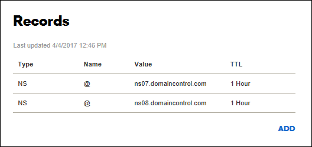

1. Sign in to the website of your domain provider.

    You can use Azure DNS to manage DNS records for your domain and configure a custom DNS name for Azure App Service. For more information, see [Tutorial: Host your domain in Azure DNS](../articles/dns/dns-delegate-domain-azure-dns.md).

1. Find the page for managing DNS records. 

    Every domain provider has its own DNS records interface, so consult the provider's documentation. Look for areas of the site labeled **Domain Name**, **DNS**, or **Name Server Management**.
    
    Often, you can find the DNS records page by viewing your account information and then looking for a link such as **My domains**. Go to that page, and then look for a link that's named something like **Zone file**, **DNS Records**, or **Advanced configuration**.

   The following screenshot is an example of a DNS records page:

   

1. Select **Add** or the appropriate widget to create a record. 

> [!NOTE]
> For certain providers, such as GoDaddy, changes to DNS records don't become effective until you select a separate **Save Changes** link.
