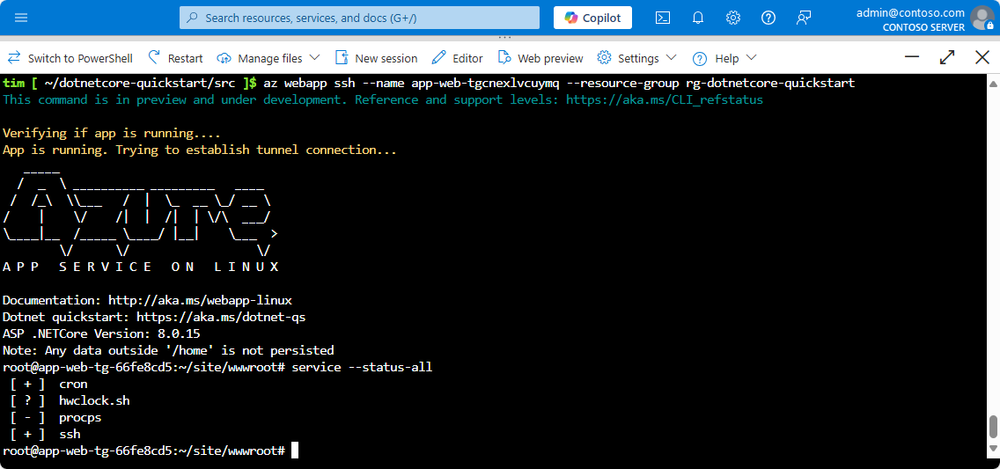

To make open a direct SSH session with your container, your app should be running.

Paste the following URL into your browser and replace \<app-name> with your app name:

```
https://<app-name>.scm.azurewebsites.net/webssh/host
```

If you're not yet authenticated, you're required to authenticate with your Azure subscription to connect. Once authenticated, you see an in-browser shell, where you can run commands inside your container.


