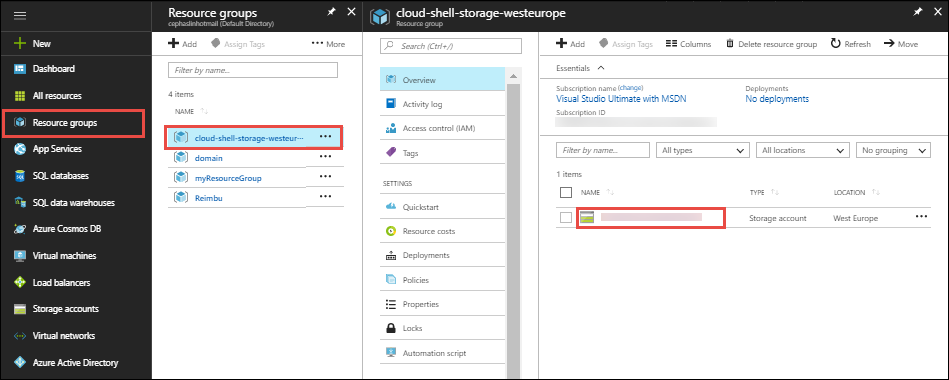
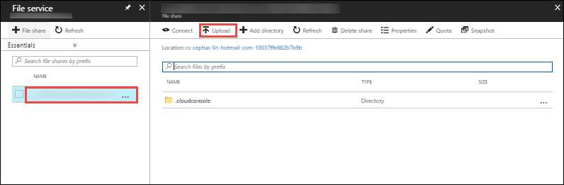

In the [Azure portal](https://portal.azure.com), click **Resource groups** > **cloud-shell-storage-\<your_region>** > **\<storage_account_name>**.



In the **Overview** page of the storage account, select **Files**.

Select the automatically generated file share and select **Upload**. This file share is mounted in the Cloud Shell as `clouddrive`.



Click the file selector and select your ZIP file, then click **Upload**. 

In the Cloud Shell, use `ls` to verify that you can see the uploaded ZIP file in the default `clouddrive` share.

```azurecli-interactive
ls clouddrive
```
