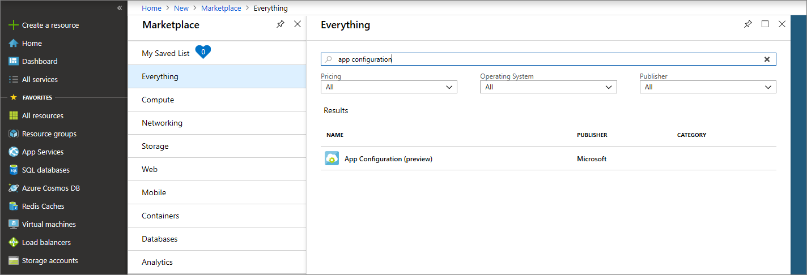
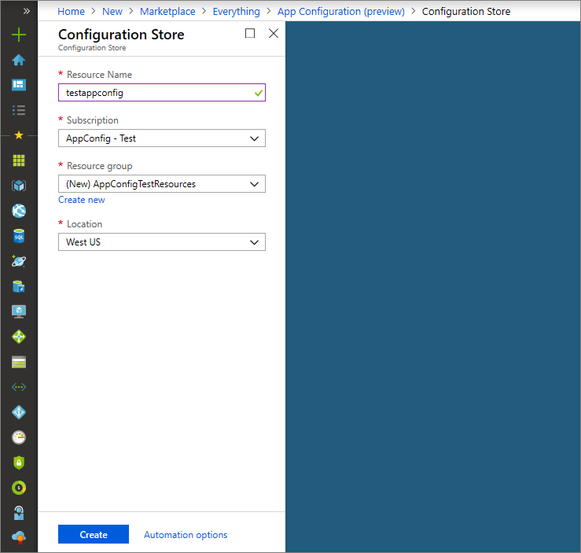

1. To create a new App Configuration store, sign in to the [Azure portal](https://portal.azure.com). In the upper-left corner of the pane, select **+Create a resource**. In the **Search the Marketplace** box, enter **App Configuration** and select Enter.

    

1. Select **App Configuration** from the search results, and then select **Create**.

1. On the **App Configuration** > **Create** pane, enter the following settings:

    | Setting | Suggested value | Description |
    |---|---|---|
    | **Resource name** | Globally unique name | Enter a unique resource name to use for the App Configuration store resource. The name must be a string between 1 and 63 characters and contain only numbers, letters, and the `-` character. The name can't start or end with the `-` character, and consecutive `-` characters aren't valid.  |
    | **Subscription** | Your subscription | Select the Azure subscription that you want to use to test App Configuration. If your account has only one subscription, it's automatically selected and the **Subscription** list isn't displayed. |
    | **Resource group** | *AppConfigTestResources* | Select or create a resource group for your App Configuration store resource. This group is useful for organizing multiple resources that you might want to delete at the same time by deleting the resource group. For more information, see [Use resource groups to manage your Azure resources](/azure/azure-resource-manager/resource-group-overview). |
    | **Location** | *Central US* | Use **Location** to specify the geographic location in which your app configuration store is hosted. For the best performance, create the resource in the same region as other components of your application. |

    

1. Select **Create**. The deployment might take a few minutes to finish.

1. After the deployment is finished, select **Settings** > **Access Keys**. Make a note of either the primary read-only or primary read-write key connection string. You'll use this connection string later to configure your application to communicate with the App Configuration store that you created.
