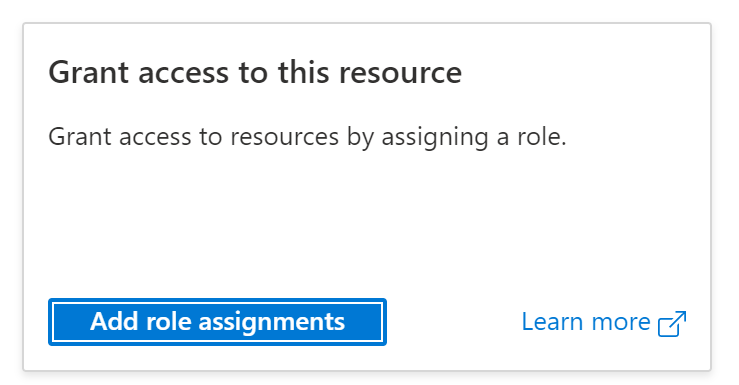
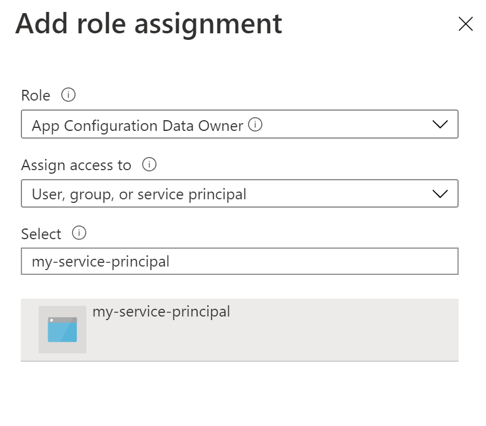

Assign the proper App Configuration role assignments to the credentials being used within the task so that the task can access the App Configuration store.

1. Navigate to your target App Configuration store. 
1. On the left, select **Access control (IAM)**.
1. On the right side, click the **Add role assignments** button.

1. Under **Role**, select **App Configuration Data Owner**. This role allows the task to read from and write to the App Configuration store. 
1. Select the service principal associated with the service connection that you created in the previous section.
