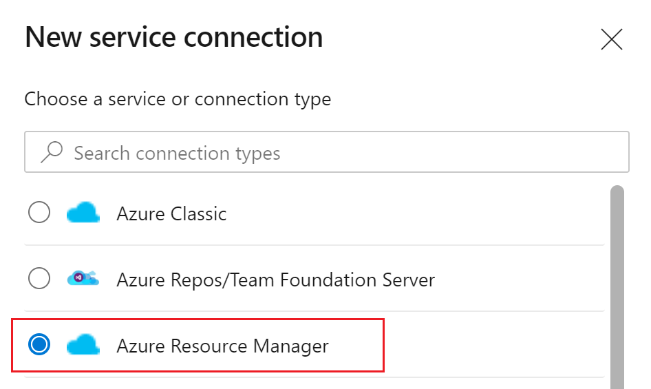
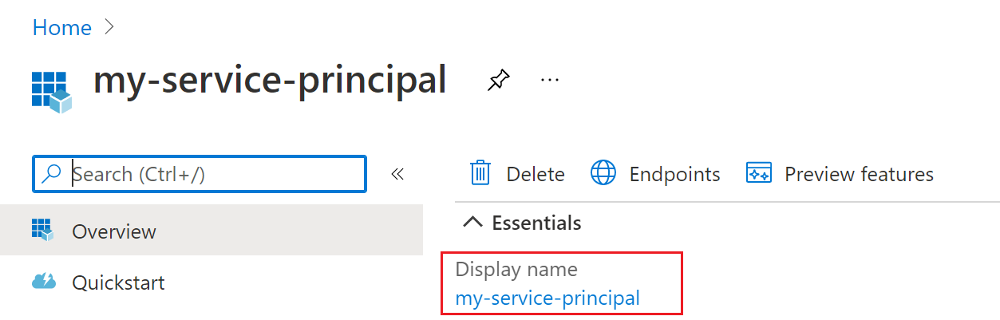

A [service connection](/azure/devops/pipelines/library/service-endpoints) allows you to access resources in your Azure subscription from your Azure DevOps project.

1. In Azure DevOps, go to the project containing your target pipeline and open the **Project settings** at the bottom left.
1. Under **Pipelines** select **Service connections** and select **New service connection** in the top right.
1. Select **Azure Resource Manager**.

1. In the **Authentication method** dialog, select **Service principal (automatic)** to create a new service principal or select **Service principal (manual)** to [use an existing service principal](/azure/devops/pipelines/library/connect-to-azure?view=azure-devops#use-spn).
1. Fill in your subscription and resource. Give your service connection a name.

If you created a new service principal, find the name of the service principal assigned to the service connection. You'll add a new role assignment to this service principal in the next step.

1. Go to **Project Settings** > **Service connections**.
1. Select the service connection that you created in the previous section.
1. Select **Manage Service Principal**.
1. Note the **Display name** listed.

