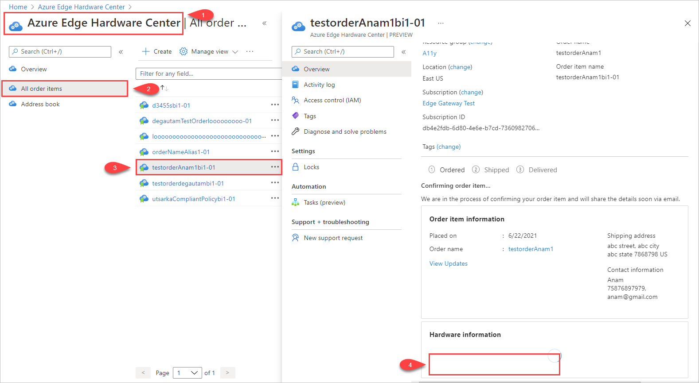
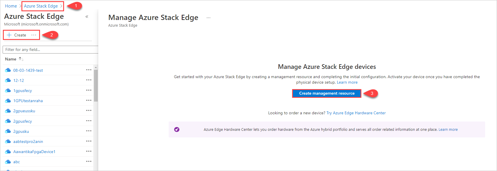

To create a management resource for a device ordered through the Azure Edge Hardware Center, do these steps:

1. Use your Microsoft Azure credentials to sign in to the Azure portal at this URL: [https://portal.azure.com](https://portal.azure.com).

1. There are two ways to get started creating a new management resource:

    - In the Azure Edge Hardware Center: Search for and select **Azure Edge Hardware Center**. In the Hardware Center, display **All order items**. Click the item **Name**. In the item **Overview**, select **Configure hardware**.
    
      The **Configure hardware** option appears after a device is shipped. 

      *Anam: Can you reproduce this view of DemoOrderASAdd1-03, so I can create the stepwise illustration? Or I can just use the order item detail screenshot from "Create a new order." Thanks!*
    
        
    
    - In Azure Stack Edge: Search for an select **Azure Stack Edge**. Select **+ Create**. Then select **Create management resource**.
    
        

    The **Create management resource** wizard opens.

1. On the **Basics** tab, enter the following settings:

    | Setting | Value              |
    |------------------------------|----------------------------------------------------------------------------------------------|
    | **Select a subscription**    | Select the subscription to use for the management resource.                                  |
    | **Resource group**           | Select the resource group to use for managing the management resource.                       |
    | **Name**                     | Provide a name for the management resource.                                                  |
    | **Deploy Azure resource in** | Select the country or region where the metadata for the management resource will reside. This can be different from the physical location of the device. |
    | **Device type**              | Select the device type. This option corresponds to the configuration that's selected for the hardware product in an Azure Edge Hardware Center order. For example, for an Azure Stack Edge Pro - GPU device, the device type is either **Azure Stack Edge Pro - 1 GPU** or **Azure Stack Edge Pro - 1 GPU**.|       

    

    Select **Review + create** to continue.

5. On the **Review + create** tab, review basic settings for the management resource and the terms and conditions for use. Then select **Create**.

    The **Create** button isn't available until all validation checks have passed. Validation checks search through the orders for the resource group, looking for an order item for the same device type that doesn't already have a management resource associated with it. *If the subscription and resource group need not be the same as for the order, this is wrong. So, what is validated?*

     

6. When the process completes, the Overview pane for new resource opens. 

     
