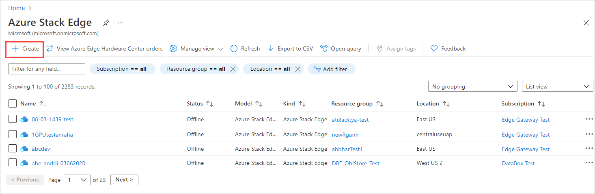
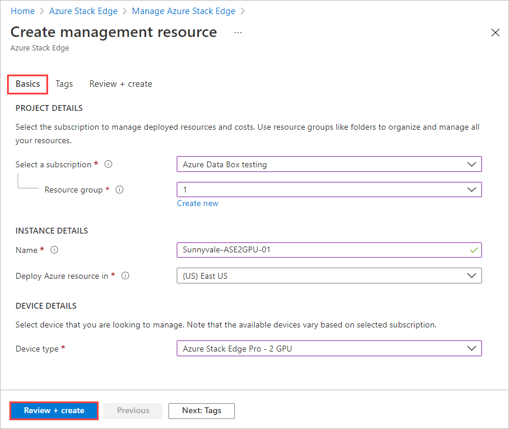

To create a management resource for a device ordered through the Azure Edge Hardware Center, do these steps:

1. Use your Microsoft Azure credentials to sign in to the Azure portal at this URL: [https://portal.azure.com](https://portal.azure.com).

1. There are two ways to get started creating a new management resource:

    - Through the Azure Edge Hardware Center: Search for and select **Azure Edge Hardware Center**. In the Hardware Center, display **All order items**. Select the item **Name**. In the item **Overview**, select **Configure hardware**.
    
       The **Configure hardware** option appears after a device is shipped. 

        
    
    - In Azure Stack Edge: Search for and select **Azure Stack Edge**. Select **+ Create**. Then select **Create management resource**.
    
        

    The **Create management resource** wizard opens.

1. On the **Basics** tab, enter the following settings:

    |Setting                                  |Value                                                                                       |
    |-----------------------------------------|--------------------------------------------------------------------------------------------|
    |**Select a subscription**1    |Select the subscription to use for the management resource.                                 |
    |**Resource group**1           |Select the resource group to use for the management resource. |
    |**Name**                                 |Provide a name for the management resource.                                                 |
    |**Deploy Azure resource in**             |Select the country or region where the metadata for the management resource will reside. The metadata can be stored in a different location than the physical device. |     

    1 An organization may use different subscriptions and resource groups to order devices than they use to manage them.

    

    Select **Review + create** to continue.

1. On the **Review + create** tab, review basic settings for the management resource and the terms of use. Then select **Create**.

   If you started in Azure Stack Edge, instead of device order information, you'll see the device type listed in **Basics**. 

    

    The **Create** button isn't available until all validation checks have passed.

1. When the process completes, the **Overview** pane for new resource opens.

     
