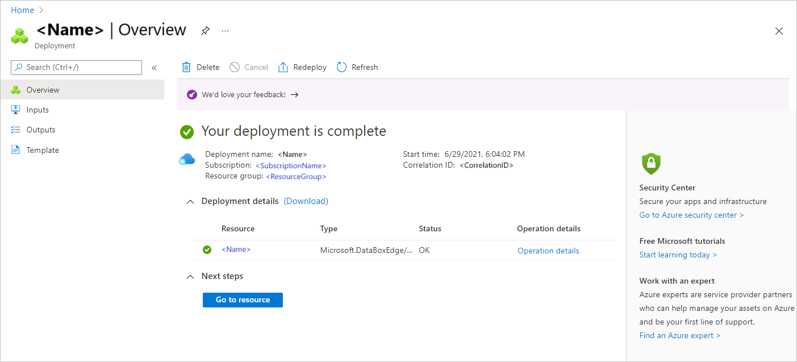

To create a management resource for a device ordered through the Azure Edge Hardware Center, do these steps:

1. Use your Microsoft Azure credentials to sign in to the Azure portal at this URL: [https://portal.azure.com](https://portal.azure.com).

<!--Alt step (subs for 2-4):
- In the Azure Edge Hardware Center: After your device is delivered, open the order, display detail for the order item, and select **Configure hardware**.
- In the Azure Stack Edge portal: Select **+ Create**. Then select **Create management resource**. You can create a management resource in this way at any time. To be linked to an order item, a management resource must have the same subscription and resource group that was used for the order.--> 

1. Search for and select **Azure Stack Edge**.

    

1. In the Azure Stack Edge portal, select **+ Create**.

    

1. Select **Create management resource**.

    

    The **Create management resource** wizard opens.

1. On the **Basics** tab, enter the following settings:<!--Check informational text for each field.-->

    | Setting                      | Value                                                                                        |
    |------------------------------|----------------------------------------------------------------------------------------------|
    | **Select a subscription**    | Select the subscription to use for the management.<!--Need not be the subscription for the order.-->|
    | **Resource group**           | Select the resource group to use for the management resource.<!--Need not be the resource group for the order.-->                                       |
    | **Name**                     | Provide a name for the management resource.                                                  |
    | **Deploy Azure resource in** | Select the country or region where the metadata for the management resource will reside. This can be different from the physical location of the device. |
    | **Device type**              | Select the device type. This option corresponds to the configuration that's selected for the hardware product in an Azure Edge Hardware Center order.<!--Too much info?--> For example, for an Azure Stack Edge Pro - GPU device, the device type is either **Azure Stack Edge Pro - 1 GPU** or **Azure Stack Edge Pro - 1 GPU**.|       

    

    Select **Review + create** to continue.

5. On the **Review + create** tab, review basic settings for the management resource and the terms and conditions for use. Then select **Create**.

    The **Create** button isn't available until all validation checks have passed. Validation checks search through the orders for the resource group, looking for an order item for the same device type that doesn't already have a management resource associated with it. *If the subscription and resource group need not be the same as for the order, this is wrong. So, what is validated?*

     

*Add confirmation step/screenshot when final portal is available.*
