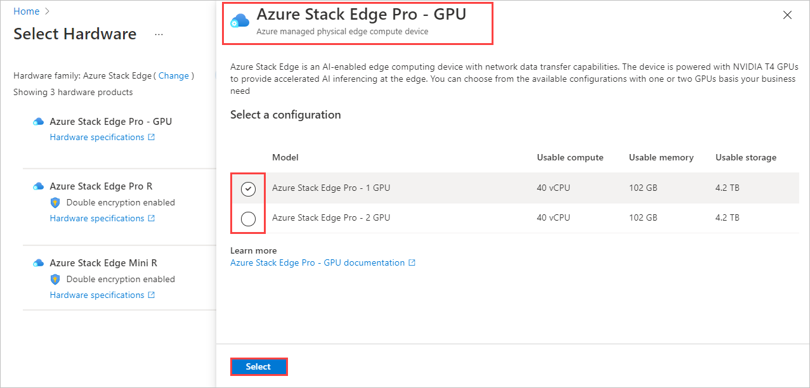
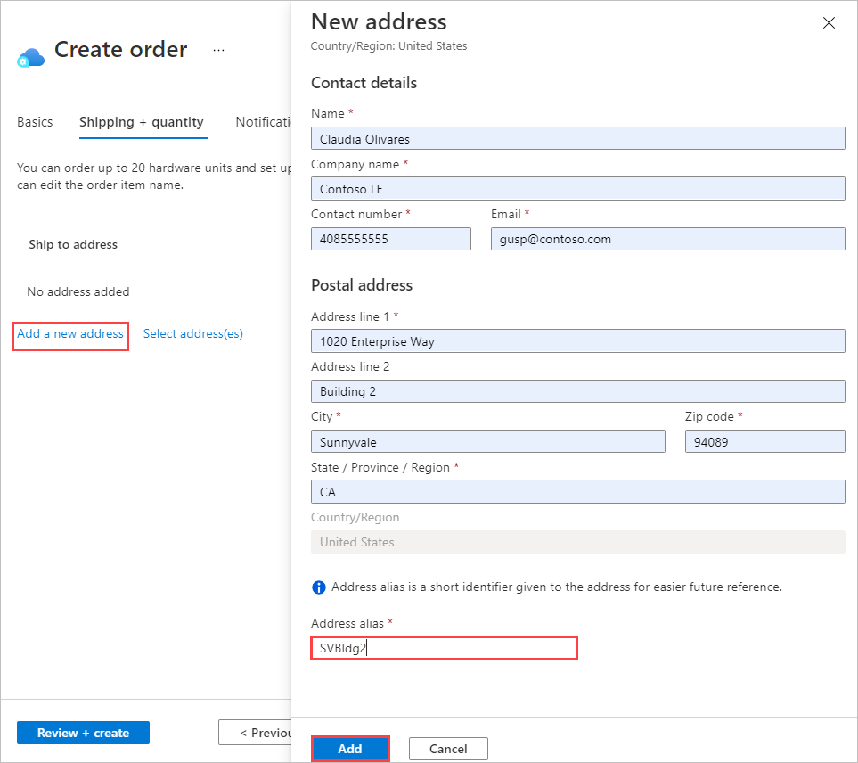
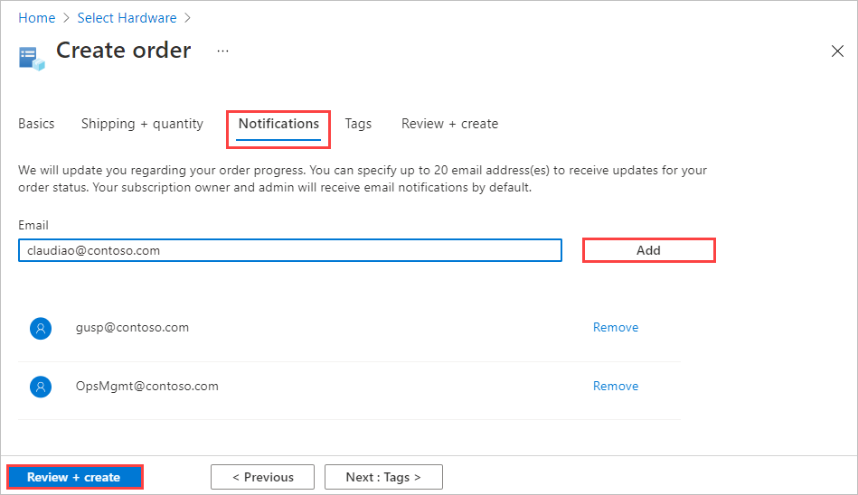
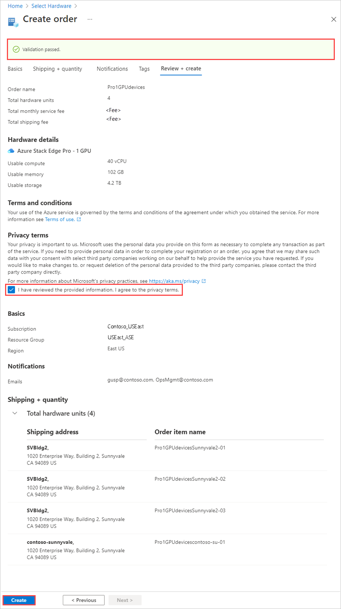
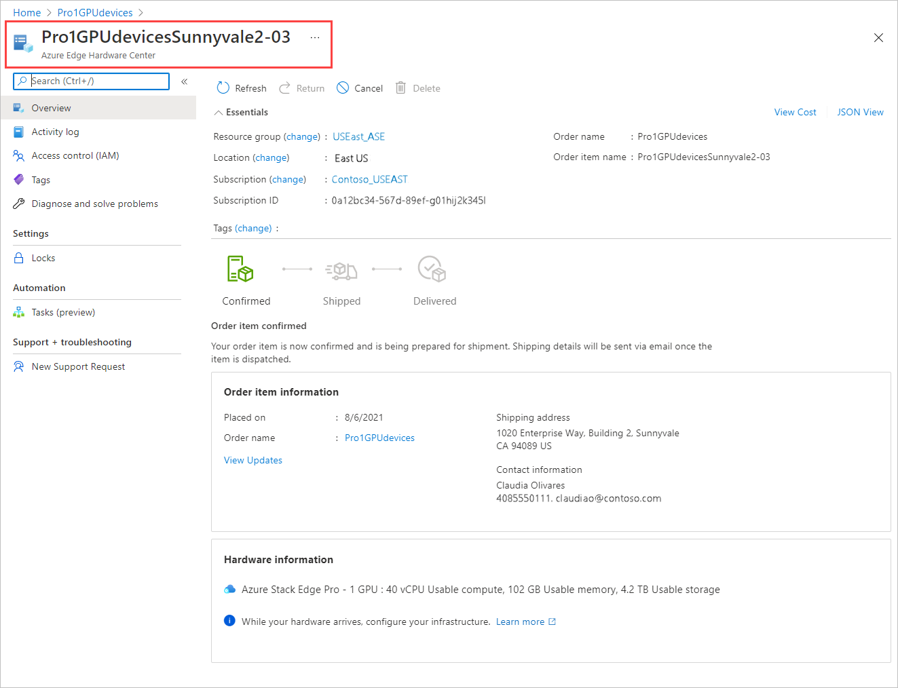
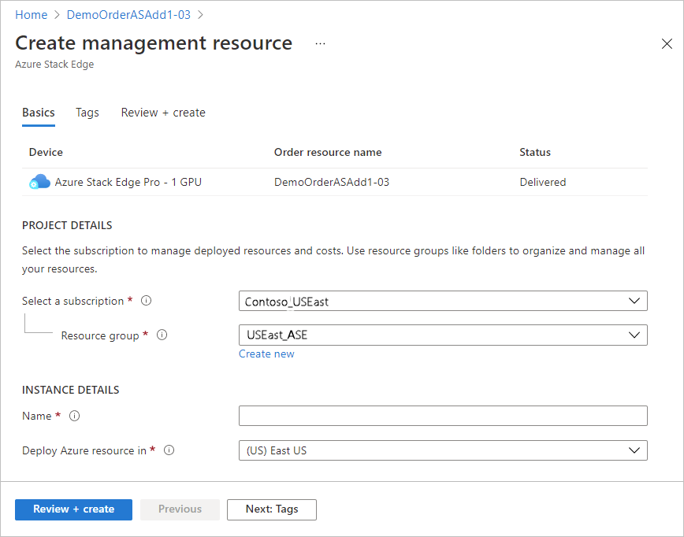

When you place an order through the Azure Edge Hardware Center, you can order multiple devices, to be shipped to more than one address, and you can reuse ship to addresses from other orders. 

Because there isn't a 1-to-1 relationship between the order and a device, no device resource is created when the order is processed. Instead, you'll need to create a *management resource* for each of the devices after the order is completed.

1. Use your Microsoft Azure credentials to sign in to the Azure portal at this URL: [https://portal.azure.com](https://portal.azure.com).

2. Search for and select **Azure Edge Hardware Center**.

    

3. In the Azure Edge Hardware Center (preview) portal, select **+ Order**.<!--Click View to open the Azure Edge Hardware Center homepage. Will use that info later.-->

    

    <!-- Alternate Steps 2-3 (to mirror Classic path): In **Azure Services**, select **+ Create a resource**. Search for "azure edge hardware center". Select **Azure Edge Hardware Center (preview)**. Select **Create**.-->

4. Select a subscription, and then select **Next**.

    

5. To start your order, select **Order** beside the product family that you want to order - for example, **Azure Stack Edge**. If you don't see the product family, you may need to use a different subscription; select **Try selecting a different subscription**. 

     

6. Select the shipping destination for your order. *QUESTION: At release, will customers be able to order from the US West country/region? Our example addresses are on the West Coast.*<!--Recommended destination for testing: SEA (Azure region).-->

    

7.  On the **Order hardware** page, use the **Select** button to select the hardware product to order. For example, select **Azure Stack Edge Pro - GPU**. 

    

    After your select a hardware product, you'll select the device configuration to order. The following hardware products and device configurations are available in the  Azure Edge Hardware Center (Preview).

    |Hardware product              |Configurations                                                                                              |
    |------------------------------|------------------------------------------------------------------------------------------------------------|
    |Azure Stack Edge Pro - GPU    |<ul><li>Azure Stack Edge Pro - 1 GPU</li><li>Azure Stack Edge Pro - 2 GPU</li><ul>                          |
    |Azure Stack Edge Pro R        |<ul><li>Azure Stack Edge Pro R - single node</li><li>Azure Stack Edge Pro R - single node with UPS</li></ul>|
    |Azure Stack Edge Mini R       |One configuration, selected automatically.<!--Configuration selection screen is skipped.-->                 |

8.  Select the device configuration, and then choose **Select**. The screen below shows available configurations for Azure Stack Edge Pro - GPU devices.

    If you're ordering Azure Stack Edge Mini R devices, which all have the same configuration, you won't see this screen. 

    <!--Remove pricing info from final graphic-->

    The **Create order** wizard opens.

9.  On the **Basics** tab, provide an **Order name** and **Resource group**. Then select **Next: Shipping + quantity**.

    
  
    On the **Shipping + quantity** tab, you'll add each ship to address you want to send devices to and then specify how many devices to send to each address. You can order up to 20 units (devices) per order.

10. On the **Shipping + quantity** tab, add each ship to address to send devices to: 

    - To add a new ship to address, select **Add a new address**. 

       

       A required **Address alias** field on the **New address** screen identifies the address for later use. Select **Add** when you finish filling in the address fields. 

       

    - To use a ship to address from a previous order, choose **Select address(es)**. Then, on the **Select address(es)** screen, select one or more addresses, and choose **Select**.

       

    The **Shipping + quantity** tab now has a separate item for each ship to address.<!--Add a screen here?-->

11. For each address, enter the **Quantity** of devices to ship on the **Shipping + quantity** tab.

     When you enter a quantity of more than one, a **+1 more** label is added to the end of the order item name.<!--Select **+ 1 more** to view the individual order items for that address. - This can wait until the next step.-->

     Each order item name includes a name prefix (the order name followed by the address alias), with an item number for each device that is shipped to that address.

     <!--Wrong screen.-->

12. If you want to change the names of order items, select and click the order item name to open the **Rename order item** pane. If you're shipping more than one item to an address, select **+n more**.

    You can make two types of name change:
 
    * To use a different name prefix for all of the order items, edit the **Name prefix** and then select **Apply**.

    * You can also edit the name of each order item individually. 

    When you finish, select **Done**.

    

    Select **Next: Notification>** to continue.

13. If you want to receive status notifications as your order progresses, enter the address for each recipient on the **Notifications** tab. To add an email address, enter the address, and select **Add**. You can add up to 20 email addresses.

    

    When you finish, select **Review + create** to continue.

14. On the **Review + create** tab:

    1. Review your order. The order is automatically validated when you open this screen. If you see a **Validation failed** banner, you'll have to fix the issues before you create the order.
    
    1. Review the **Privacy terms**, and select the check box to agree to them.
 
    1. Select **Create**.

    

    While the order is being deployed, the order opens in the Azure portal, showing the status of each order item. After deployment completes, you may need to click the Down arrow by **Deployment details** to see the status of individual items.

    

15. To view details for an order item, select the item name.

    The details show ... . After a device is delivered, a **Configure hardware** option is added to the details. Select that option to create a management resource for the device in Azure Stack Edge.    

    *Add screenshot when release portal is available.*

    After the device is activated, you can open the device from the item details by *ADD INSTRUCTION*.

    *Add screenshot.*

<!--Artifact of "Next step: Open resource group" instruction, which I think went away. - 

