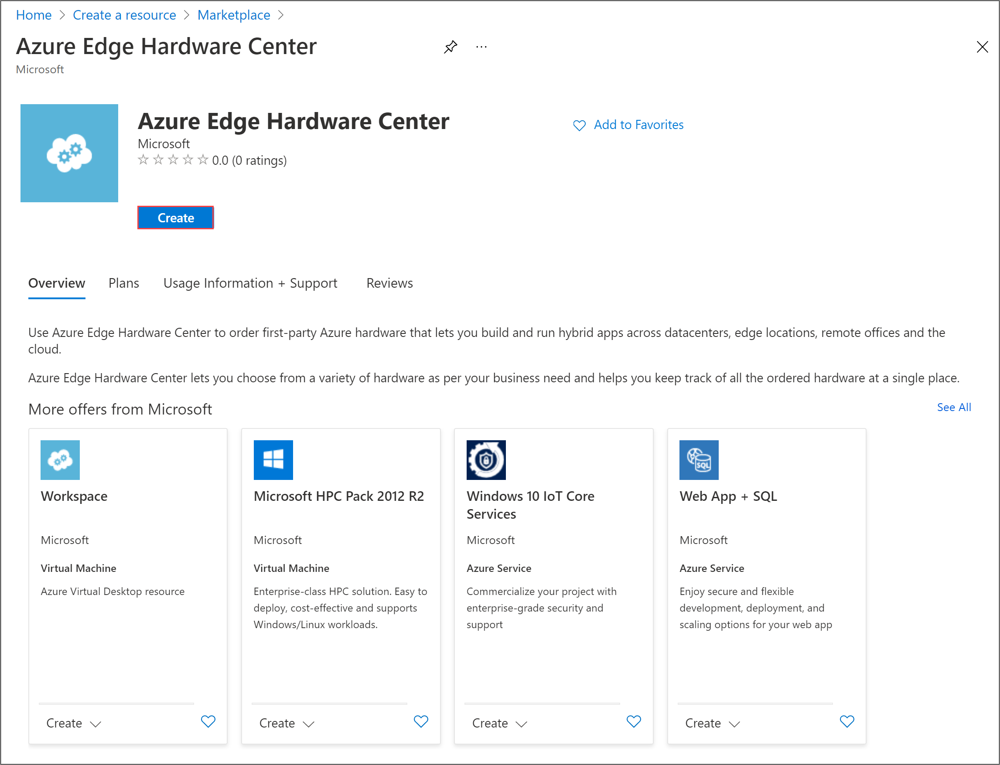
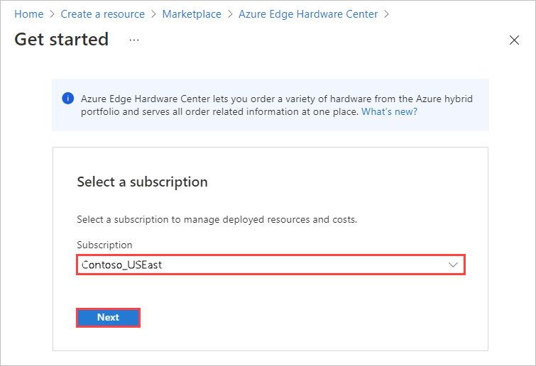
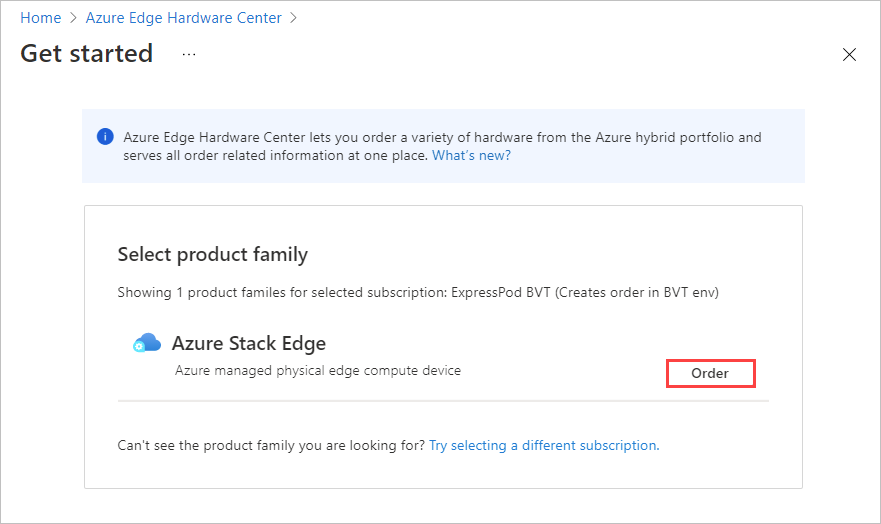
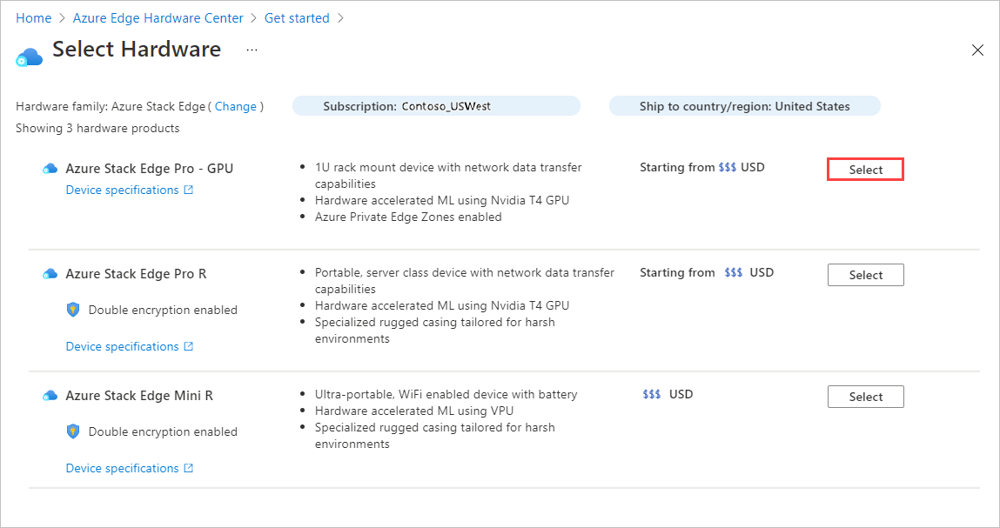
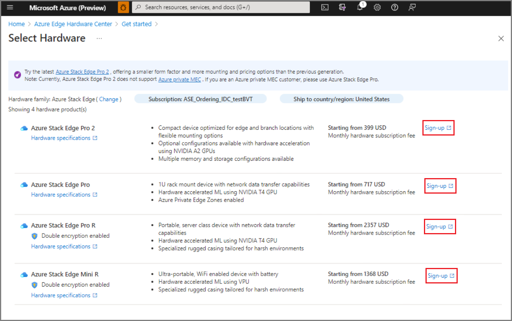
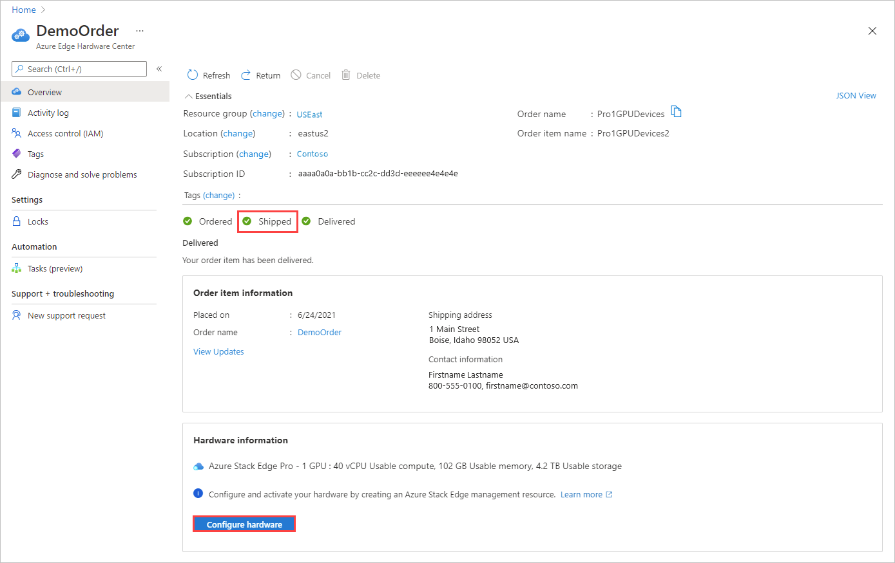

To place an order through the Azure Edge Hardware Center, do these steps:

1. Use your Microsoft Azure credentials to sign in to the Azure portal at this URL: [https://portal.azure.com](https://portal.azure.com).

2. Select **+ Create a resource**. Search for and select **Azure Edge Hardware Center**. In the Azure Edge Hardware Center, select **Create**.

    

3. Select a subscription, and then select **Next**.

    

4. To start your order, select **Order** beside the product family that you want to order - for example, **Azure Stack Edge**. If you don't see the product family, you may need to use a different subscription; select **Try selecting a different subscription**. 

     

5. Select the shipping destination for your order.

    

6. On the **Select Hardware** page, use the **Select** button to select the hardware product to order. For example, here **Azure Stack Edge Pro - GPU** was selected. 

    

    After you select a hardware product, you'll select the device configuration to order. For example, if you chose Azure Stack Edge Pro - GPU, you can choose from Azure Stack Edge Pro - 1 GPU and Azure Stack Edge Pro - 2 GPU models.

    If you are placing a first-time order for Azure Stack Edge, select **Sign-up** and fill out the web form as part of the Azure Edge Hardware Center ordering experience.

    The web form collects the following details about your deployment:
   - Total deployment scale 
   - Cluster size 
   - Hardware requirements 
   - Geographic presence 

   Microsoft will evaluate the deployment details you provide and may contact you by email for more information. We have certain requirements in place for new customers to ensure that Azure Stack Edge is the right fit for the use case; not all requests will be fulfilled. If you have questions, you can send email to [AzureStack1Pinquiry@microsoft.com](mailto:AzureStack1Pinquiry@microsoft.com).

   

7. Select the device configuration, and then choose **Select**. The available configurations depend on the hardware you selected. The screen below shows available configurations for Azure Stack Edge Pro - GPU devices.

    If you're ordering Azure Stack Edge Mini R devices, which all have the same configuration, you won't see this screen. 

    

    The **Create order** wizard opens.

8.  On the **Basics** tab, provide an **Order name**, **Resource group**, and **Region**. Then select **Next: Shipping + quantity >**.

    
  
    Next, you'll add each ship to address you want to send devices to and then specify how many devices to send to each address. You can order up to 20 units (devices) per order.

9. On the **Shipping + quantity** tab, add each ship to address to send devices to: 

    - To add a new ship to address, select **Add a new address**. 

       A required **Address alias** field on the **New address** screen identifies the address for later use. Select **Add** when you finish filling in the address fields. Then use **Select address(es)** to add the address to your order.

       

    - To use a ship to address from a previous order, or to use an address that you just added, choose **Select address(es)**. Then, on the **Select address(es)** screen, select one or more addresses, and choose **Select**.

       

    The **Shipping + quantity** tab now has a separate item for each ship to address.

    Each order item name includes a name prefix (the order name followed by the address alias), with an item number for each device that is shipped to that address.

    

10. For each address, enter the **Quantity** of devices to ship on the **Shipping + quantity** tab.

    When you enter a quantity of more than one, a **+n more** label appears after the order item name.

     

11. If you want to change the names of order items, select and click the order item name to open the **Rename order item** pane. If you're shipping more than one item to an address, select **+n more**.

    You can make two types of name change:
 
    * To use a different name prefix for all of the order items, edit the **Name prefix** and then select **Apply**, as shown on the following screen.

    * You can also edit the name of each order item individually. 

    When you finish, select **Done**.

    

    Select **Next: Notifications >** to continue.

12. If you want to receive status notifications as your order progresses, enter the email address for each recipient on the **Notifications** tab. 

    To add an email address, enter the address, and select **Add**. You can add up to 20 email addresses.

    

    When you finish, select **Review + create** to continue.

13. On the **Review + create** tab:

    1. Review your order. The order is automatically validated when you open this screen. If you see a **Validation failed** banner, you'll have to fix the issues before you create the order.
    
    1. Review the **Privacy terms**, and select the check box to agree to them.
 
    1. Select **Create**.

    

    During deployment, the order opens in the portal, with the status of each order item displayed. After deployment completes, you may need to click the Down arrow by **Deployment details** to see the status of individual items.

    

14. To view details for an order item, shown below, select the item in the **Resource** column of the deployment details.

    

15. After a device ships (**Shipped** tag is green), a **Configure hardware** option is added to the item details. Select that option to create a management resource for the device in Azure Stack Edge.    

    

    The subscription, resource group, and deployment area are filled in from the order, but you can change them.

    

    After you activate the device, you'll be able to open the management resource from the item, and open the order item from the management resource.
