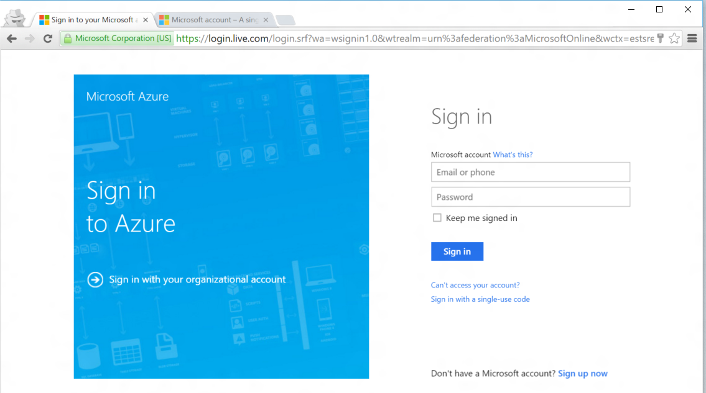

<!--
includes/azure-include-getting-started-v12portal-gettings-an-account.md

Latest Freshness check:  2016-04-11 , carlrab.

As of circa 2016-04-11, the following topics might include this include:
articles/sql-database/sql-database-get-started-tutorial.md

-->
## Connecting to the Microsoft Azure portal with a subscription

To connect to the Microsoft Azure portal, you must have a subscription. 

### Get a new account

If you do not have an existing Microsoft Azure account, follow one of the links below to obtain an account:

- Get a [free account](https://azure.microsoft.com/get-started/)
- Use an [MSDN subscription](https://azure.microsoft.com/pricing/member-offers/msdn-benefits/)

###Sign in using your existing account

Using your [existing subscription]( https://account.windowsazure.com/Home/Index), follow the steps below to connect to the Azure portal. 

1. Open your browser of choice and connect to the [Azure portal](https://portal.azure.com/).

1. Sign in to the [Azure portal](https://portal.azure.com/).

1. When the sign in page appears, provide the credentials for your subscription

   
   
