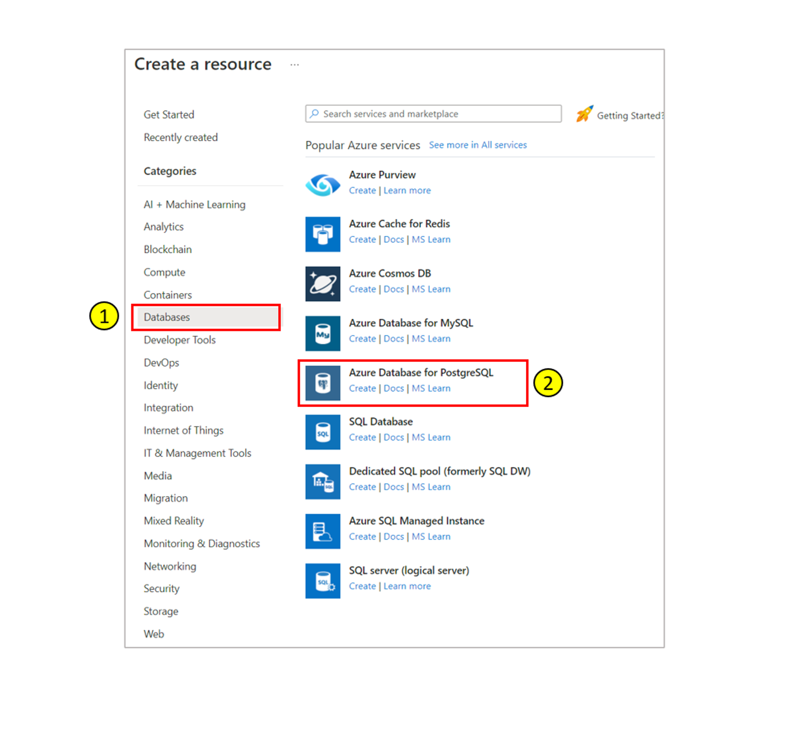
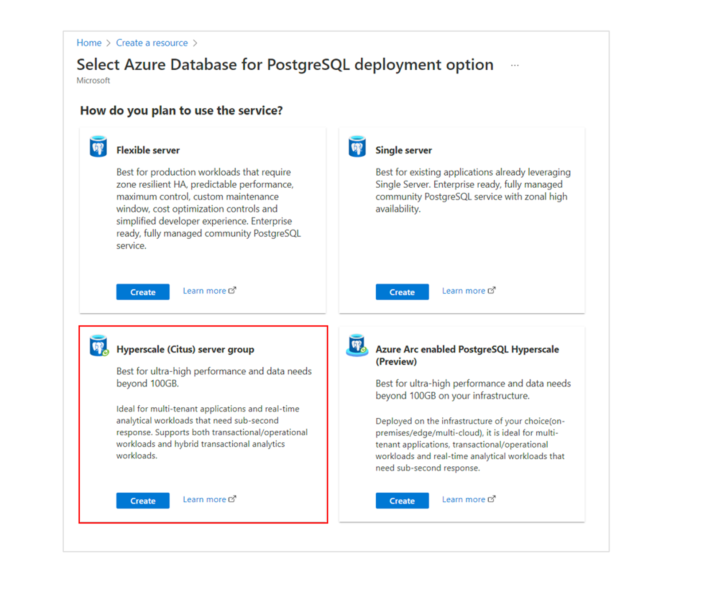
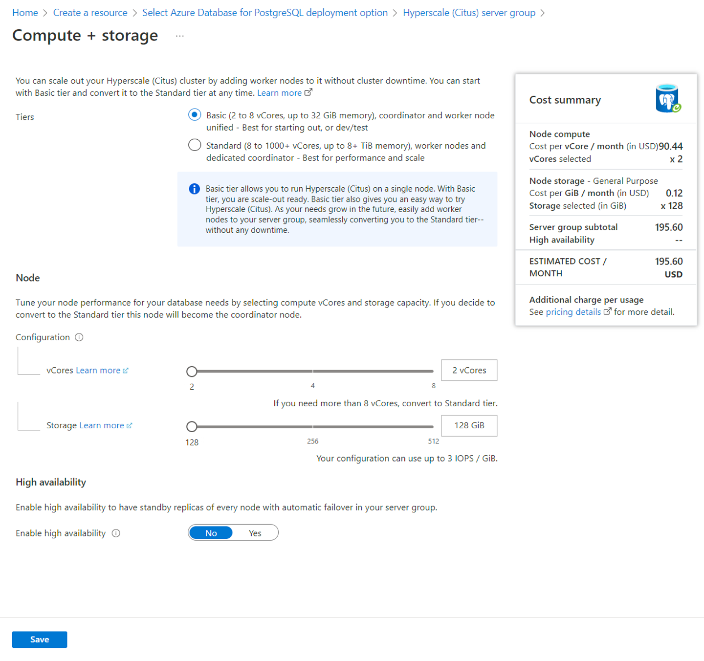
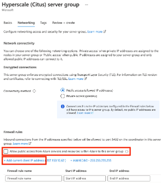

If you don't have an Azure subscription, create a
[free](https://azure.microsoft.com/free/) account before you begin.

### Sign in to the Azure portal

Sign in to the [Azure portal](https://portal.azure.com).

Follow these steps to create an Azure Database for PostgreSQL server:

1. Select **Create a resource** (+) in the upper-left corner of the portal.
2. Select **Databases** > **Azure Database for PostgreSQL**.
   
3. Select the **Hyperscale (Citus) server group** deployment option.
   
4. Fill out the **Basics** form with the following information:
   

   | Setting           | Description       |
   |-------------------|-------------------|
   | Subscription      | The Azure subscription that you want to use for your server. If you have multiple subscriptions, choose the subscription in which you'd like to be billed for the resource. |
   | Resource group    | A new resource group name or an existing one from your subscription. |
   | Server group name | A unique name that identifies your Hyperscale server group. The domain name postgres.database.azure.com is appended to the server group name you provide. The server can contain only lowercase letters, numbers, and the hyphen (-) character. It must contain fewer than 40 characters. |
   | Location          | The location that is closest to your users. |
   | Admin username    | Currently required to be the value `citus`, and can't be changed. |
   | Password          | A new password for the server admin account. It must contain between 8 and 128 characters. Your password must contain characters from three of the following categories: English uppercase letters, English lowercase letters, numbers (0 through 9), and non-alphanumeric characters (!, $, #, %, etc.). |
   | Version           | The latest PostgreSQL major version, unless you have specific requirements. |
   | Compute + storage | The compute, storage, and Tier configurations for your new server. Select **Configure server group**. |

   

5. For the purpose of this quickstart, you can accept the default value of
   **Basic** for **Tiers**. The other option, standard tier, creates worker
   nodes for greater total data capacity and query parallelism. See
   [tiers](../articles/postgresql/hyperscale/concepts-server-group.md#tiers)
   for a more in-depth comparison.
6. Select **Next : Networking >** at the bottom of the screen.
7. In the **Networking** tab, select **Allow public access from Azure services
   and resources within Azure to this server group**. Then select **+ Add
   current client IP address**. 

   

   > [!NOTE]
   > Azure PostgreSQL server communicates over port 5432. If you are trying to
   > connect from within a corporate network, outbound traffic over port 5432
   > may not be allowed by your network's firewall. If so, you cannot connect
   > to your Hyperscale (Citus) cluster unless your IT department opens port
   > 5432.

8. Select **Review + create** and then **Create** to create the server.
   Provisioning takes a few minutes.
9. The page will redirect to monitor deployment. When the live status changes
   from **Your deployment is underway** to **Your deployment is complete**,
   select the **Outputs** menu item on the left of the page.
10. The outputs page will contain a coordinator hostname with a button next to
   it to copy the value to the clipboard. Record this information for later
   use.
