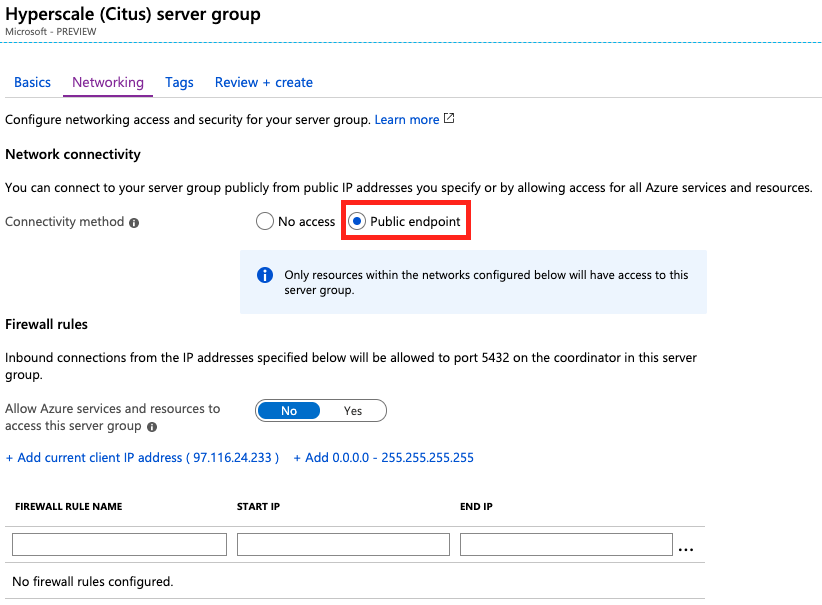
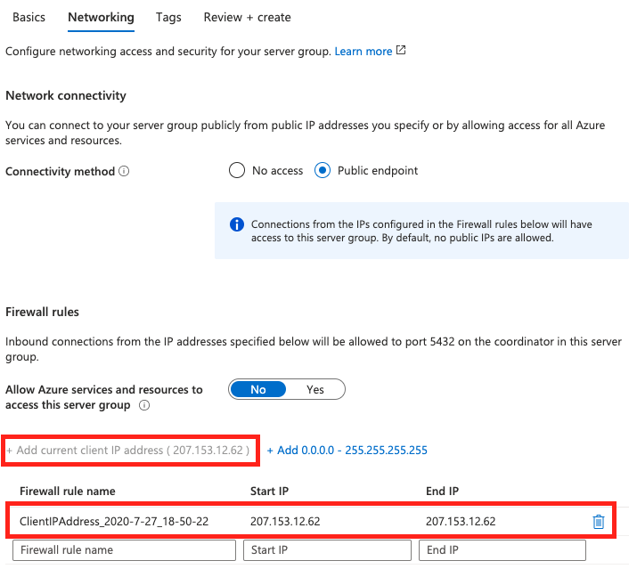

If you don't have an Azure subscription, create a [free](https://azure.microsoft.com/free/) account before you begin.

## Sign in to the Azure portal

Sign in to the [Azure portal](https://portal.azure.com).

## Create an Azure Database for PostgreSQL - Hyperscale (Citus)

Follow these steps to create an Azure Database for PostgreSQL server:
1. Click **Create a resource**  in the upper left-hand corner of the Azure portal.
2. Select **Databases** from the **New** page, and select **Azure Database for PostgreSQL** from the **Databases** page.
3. For the deployment option, click the **Create** button under **Hyperscale (Citus) server group.**
4. Fill out the new server details form with the following information:
   - Resource group: click the **Create new** link below the text box for this field. Enter a name such as **myresourcegroup**.
   - Server group name: enter a unique name for the new server group, which will also be used for a server subdomain.
   - Admin username: currently required to be the value **citus**, and can't be changed.
   - Password: must be at least eight characters long and contain characters from three of the following categories – English uppercase letters, English lowercase letters, numbers (0-9), and non-alphanumeric characters (!, $, #, %, and so on.)
   - Location: use the location that is closest to your users to give them the fastest access to the data.

   > [!IMPORTANT]
   > The server admin password that you specify here is required to log in to the server and its databases. Remember or record this information for later use.

5. Click **Configure server group**. Leave the settings in that section unchanged and click **Save**.
6. Click **Next : Networking >** at the bottom of the screen.

7. In the **Networking** tab, click the **Public endpoint** radio button.
   
8. Click the link **+ Add current client IP address**.
   

   > [!NOTE]
   > Azure PostgreSQL server communicates over port 5432. If you are trying to connect from within a corporate network, outbound traffic over port 5432 may not be allowed by your network's firewall. If so, you cannot connect to your Hyperscale (Citus) cluster unless your IT department opens port 5432.
   >

9. Click **Review + create** and then **Create** to provision the server. Provisioning takes a few minutes.
10. The page will redirect to monitor deployment. When the live status changes from **Your deployment is underway** to **Your deployment is complete**, click the **Outputs** menu item on the left of the page.
11. The outputs page will contain a coordinator hostname with a button next to it to copy the value to the clipboard. Record this information for later use.

## Connect to the database using psql

When you create your Azure Database for PostgreSQL server, a default database named **citus** is created. To connect to your database server, you need a connection string and the admin password.

1. Obtain the connection string. In the server group page click the **Connection strings** menu item. (It's under **Settings**.) Find the string marked **psql**. It will be of the form:

   ```
   psql "host=hostname.postgres.database.azure.com port=5432 dbname=citus user=citus password={your_password} sslmode=require"
   ```

   Copy the string. You will need to replace "{your\_password}" with the administrative password you chose earlier. The system doesn't store your plaintext password and so can't display it for you in the connection string.

2. Open a terminal window on your local computer.

3. At the prompt, connect to your Azure Database for PostgreSQL server with the [psql](https://www.postgresql.org/docs/current/app-psql.html) utility. Pass your connection string in quotes, being sure it contains your password:
   ```bash
   psql "host=..."
   ```

   For example, the following command connects to the coordinator node of the server group **mydemoserver**:

   ```bash
   psql "host=mydemoserver-c.postgres.database.azure.com port=5432 dbname=citus user=citus password={your_password} sslmode=require"
   ```
