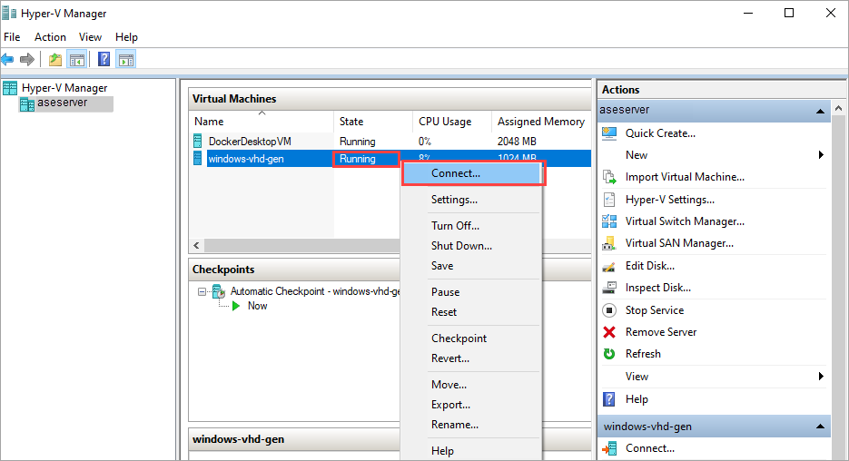
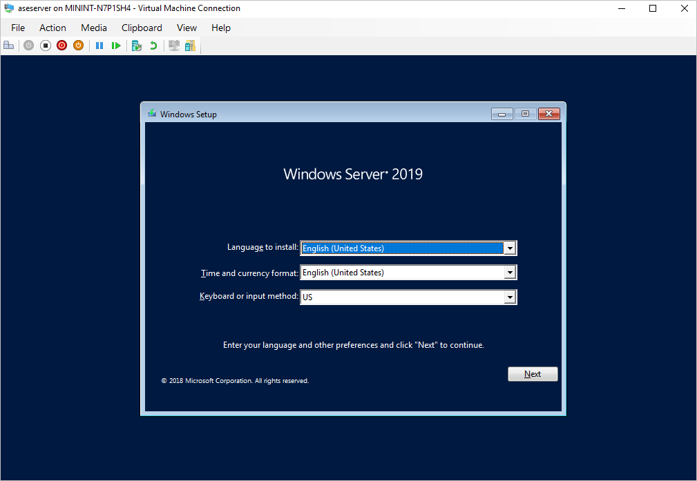

To finish building your virtual machine, you need to start the virtual machine and walk through the operating system installation.

1. In **Hyper-V Manager**, in the scope pane, right-click the VM to open the context menu, and then select **Start**. 

    

2. The VM state is **Running**. Select the VM, and then right-click and select **Connect**.

    

3. The virtual machine boots into setup, and you can walk through the installation like you would on a physical computer.
 
   <!--To verify or reshoot, create a real VM using the ISO from 03/31 sync.-->

<!--Compare with the Hyper-V VM steps in https://docs.microsoft.com/en-us/virtualization/hyper-v-on-windows/quick-start/create-virtual-machine#complete-the-operating-system-deployment. Should licensing be raised as an issue in the Azure Stack Edge version?-->
