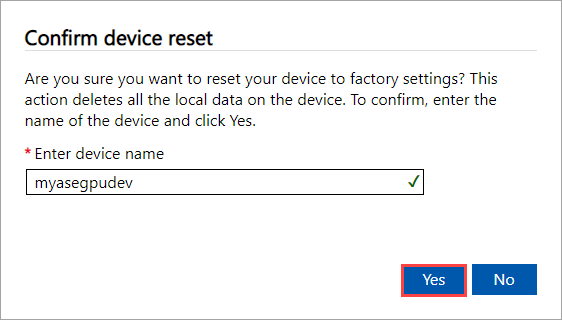

To reset your device using the local web UI, take the following steps.

1. In the local web UI, go to **Maintenance > Device reset**.
2. Select **Reset device**.

    

3. When prompted for confirmation, review the warning. Type **Yes** and then select **Yes** to continue.

      

The reset erases the data off the device data disks. Depending on the amount of data on your device, this process takes about 30-40 minutes.

## Remove Azure resources from your Azure Stack Edge device
 
In addition to resetting your device, complete the following steps to remove Azure resources associated with the device.

Delete the Azure Stack Edge resource (name of the service) associated with the Azure Stack Edge device. You can also use this step to remove the associated key vault. This step also removes the managed identity associated with the Azure Stack Edge resource. Gather key vault details before you delete the Azure Stack Edge resource.

Use the following steps to delete the Azure Stack Edge resource, its managed identity, the associated key vault, and the Azure storage account:

1. In Azure portal, go to your key vault, navigate to **Diagnostic settings**, and make note of the storage account name and the key vault name.
1. Go to your Azure Stack Edge resource and then to **Overview**. From the command bar, select **Delete**.
1. In the Delete device blade, specify the name of the device you want to delete and then select **Delete**.
1. To continue, confirm the delete operation.
1. When deleting the Azure Stack Edge resource, you'll also be prompted to remove the associated key vault. To get the key vault name, select **Security** in left navigation, and then select the key vault name to get to the key vault resource. The key vault name starts with the service name and is appended with a GUID. Select **Diagnostic settings** and also note the storage account name.
1. Delete the Azure storage account used by the key vault. Look for a Zone redundant storage account in the same scope as the Azure Stack Edge resource; manually delete the storage account.

>[!Note]
>While performing the device reset, only the data that resides locally on the device will be deleted. The data that's in the cloud won't be deleted and, if not removed, will continue to collect [charges](https://azure.microsoft.com/pricing/details/storage/). This data must be deleted separately using a cloud storage management tool like [Azure Storage Explorer](https://azure.microsoft.com/features/storage-explorer/).
