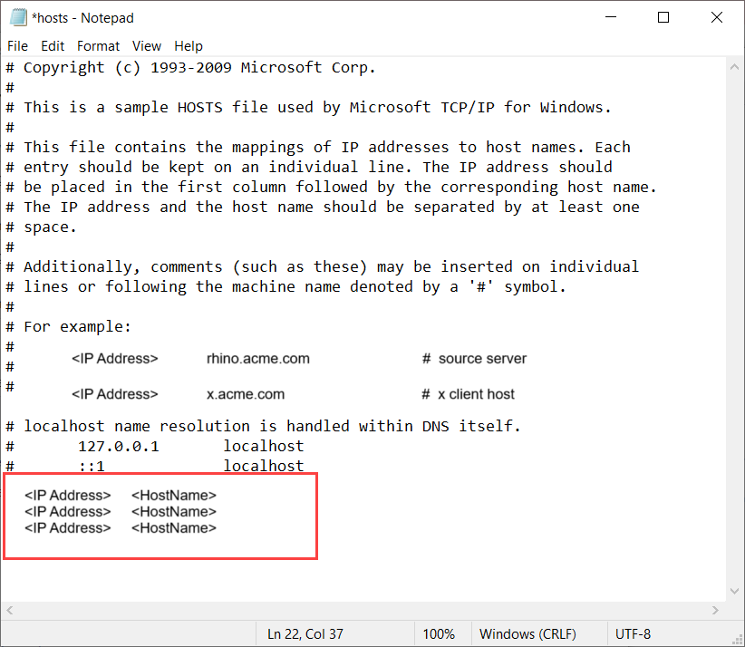

1. Go to the local web UI of your device and sign into your device. Ensure that the device is unlocked.

2. Go to the **Network settings** page. Make a note of the device IP address for the network interface used to connect to the client.

3. If working with a remote Windows client, start **Notepad** as an administrator, and then open the hosts file located at `C:\Windows\System32\Drivers\etc`.

4. Add the following entry to your hosts file: `<Device IP address> <Blob service endpoint>`

    You got the blob service endpoint from the Edge storage account created in the Azure portal. You will use the suffix of the blob service endpoint only.

    For reference, use the following image. Save the `hosts` file.

    