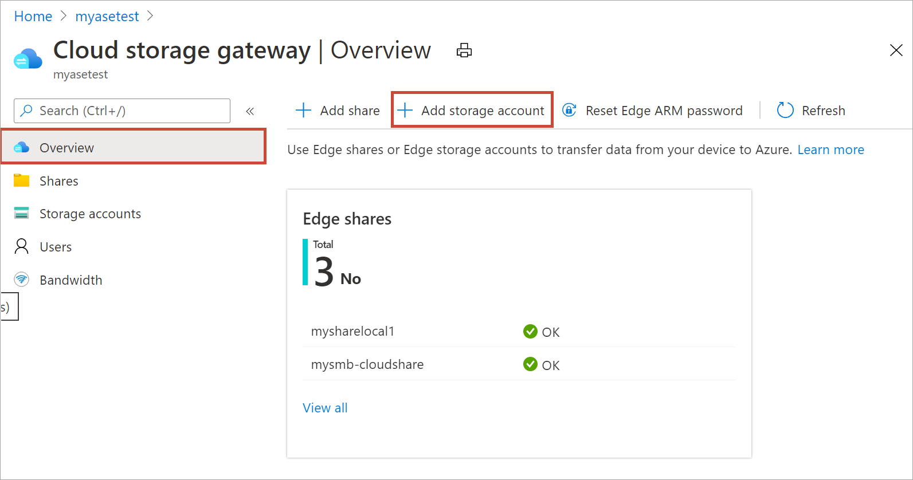
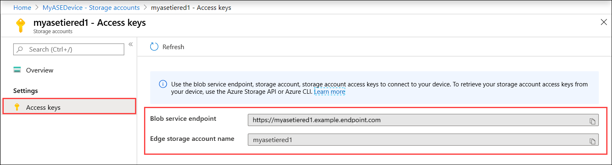

1. In the [Azure portal](https://portal.azure.com/), select your Azure Stack Edge resource and then go to the **Overview**. Your device should be online. Go to **Cloud storage gateway > Storage accounts**.

2. Select **+ Add storage account** on the device command bar. 

   

3. In the **Add Edge storage account** pane, specify the following settings:

    1. Provide a unique name for the Edge storage account on your device. Storage account names can only contain lowercase numbers and letters. Special characters are not allowed. Storage account name has to be unique within the device (not across the devices).

    2. Provide an optional description for the information on the data the storage account is holding.  
    
    3. By default, the Edge storage account is mapped to an Azure Storage account in the cloud, and the data from the storage account is automatically pushed to the cloud. Specify the Azure storage account that your Edge storage account is mapped to.
   > [!IMPORTANT]
   > Tiering data from an Azure Stack Edge Pro device to the mapped Azure Storage account uses Managed Service Identity to authorize the data access. Make sure that the Azure Storage account that you use has the following roles being assigned to the Managed identities for Azure Stack Edge resource:
   >
   > * Storage Blob Data Contributor
   > * Storage File Data Privileged Contributor
   > * Contributor
   > 
   > For more information, see [Assign an Azure role for access to blob data](/azure/storage/blobs/assign-azure-role-data-access?tabs=portal#assign-an-azure-role).

    4. Create a new container, or select from an existing container in the Azure storage account. Any data from the device that is written to the Edge storage account is automatically uploaded to the selected storage container in the mapped Azure Storage account.

    5. After all the storage account options are specified, select **Add** to create the Edge storage account. You are notified when the Edge storage account is  successfully created. The new Edge storage account is then displayed in the list of storage accounts in the Azure portal.

    <!--[Add a storage account](media/azure-stack-edge-gateway-add-storage-account/add-storage-account-2.png)-->
    
4. If you select this new storage account and go to **Access keys**, you can find the blob service endpoint and the corresponding storage account name. Copy this information as these values together with the access keys will help you connect to the Edge storage account.

    

    You get the access keys by [Connecting to the device local APIs using Azure Resource Manager](../articles/databox-online/azure-stack-edge-gpu-connect-resource-manager.md).
