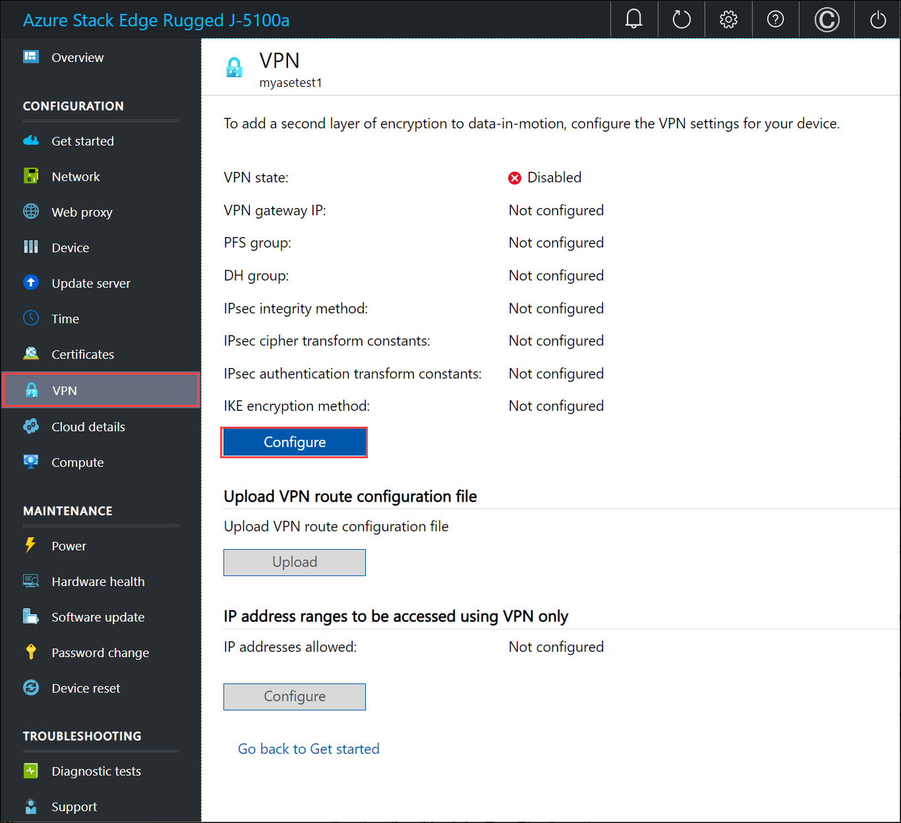
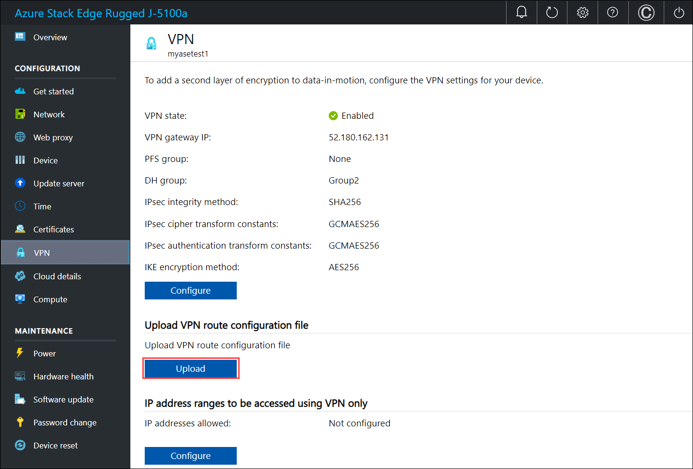
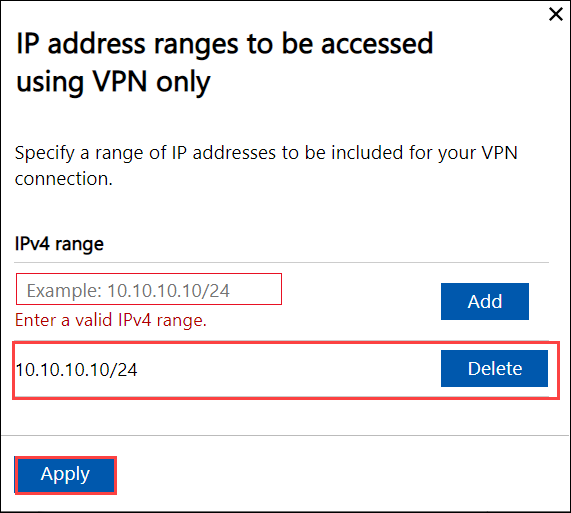

Do the following steps in the local web UI of your device. This step takes about 15 minutes including the upload of the VPN configuration file (or the service tag file). 

1. Go to **Configuration > VPN**. Select **Configure**.

    

2. In the **Configure VPN** blade:

    - Enable **VPN settings**.
    - Provide the **VPN shared secret**. This is the shared key you provided while creating the Azure VPN connection resource.
    - Provide the **VPN gateway IP** address. This is the Azure local network gateway IP address.
    - For **PFS group**, select **None**. 
    - For **DH group**, select **Group2**.
    - For **IPsec integrity method**, select **SHA256**.
    - For **IPsec cipher transform constants**, select **GCMAES256**.
    - For **IPsec authentication transform constants**, select **GCMAES256**.
    - For **IKE encryption method**, select **AES256**.
    - Select **Apply**.

        

    For more information about the cryptographic algorithms supported, go to [About cryptographic requirements and Azure VPN gateways](../articles/vpn-gateway/vpn-gateway-about-compliance-crypto.md#ipsecike-policy-faq). 

3. To upload the VPN route configuration file, select **Upload**. 

    

    - Browse to the service tags *json* file that you downloaded on your local system in the previous step.
    - Select the region as the Azure region associated with the device, virtual network, and gateways.
    - Select **Apply**.

        
    
    The upload takes about 7-8 minutes on the device.

4. To add client-specific routes, configure IP address ranges to be accessed using VPN only. 

    - Under **IP address ranges to be accessed using VPN only**, select **Configure**.
    - Provide a valid IPv4 range and select **Add**. Repeat the steps to add other ranges.
    - Select **Apply**.

        

