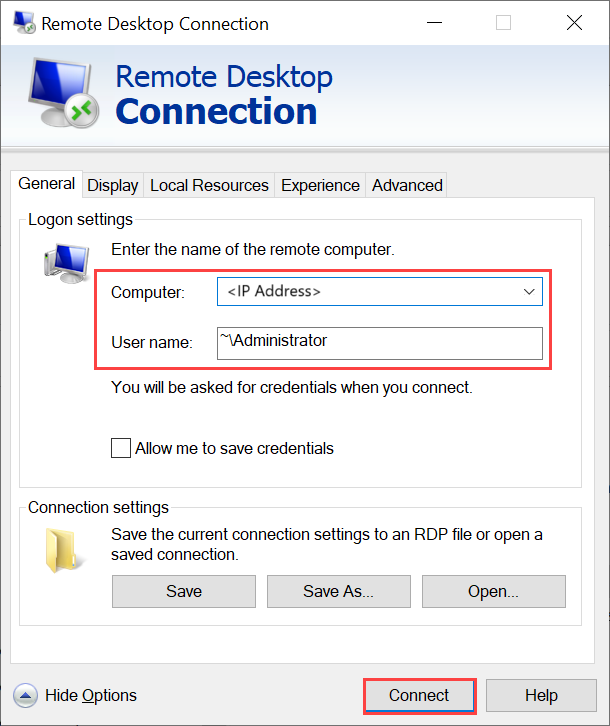

Connect to your Windows VM by using the Remote Desktop Protocol (RDP) via the IP that you passed during the VM creation.

1. On your client, open RDP. 
1. Go to **Start**, and then enter **mstsc**.
1. On the **Remote Desktop Connection** pane, enter the IP address of the VM and the access credentials you used in the VM template parameters file. Then select **Connect**.

   

   > [!NOTE]
   > You might need to approve connecting to an untrusted machine. 

You're now signed in to your VM that runs on the appliance. 
