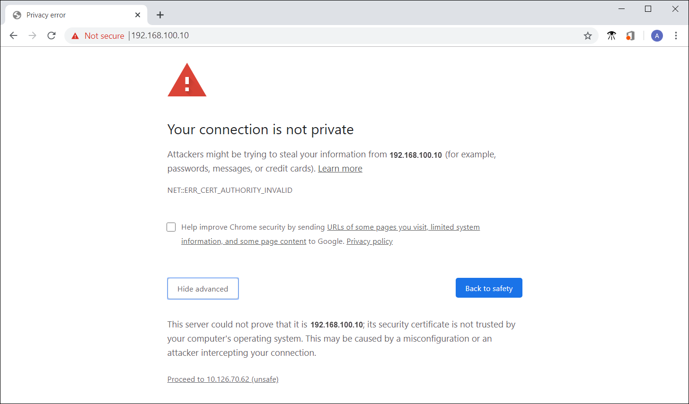
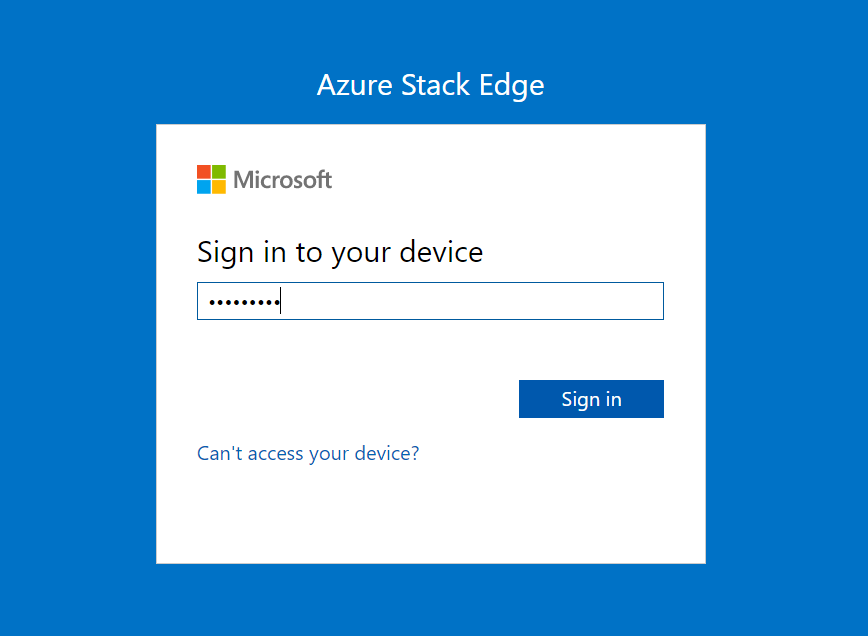

1. Open a browser window and access the local web UI of the device at `https://192.168.100.10`. This action may take a few minutes after you've turned on the device.

    You see an error or a warning indicating that there is a problem with the website's security certificate. 
   
    

1. Select **Continue to this webpage**. These steps might vary depending on the browser you're using.

1. Sign in to the web UI of your device. The default password is *Password1*. 
   
    

1. At the prompt, change the device administrator password.  
    The new password must contain between 8 and 16 characters. It must contain three of the following characters: uppercase, lowercase, numeric, and special characters.

You're now at the **Overview** page of your device. The next step is to configure the network settings for your device.