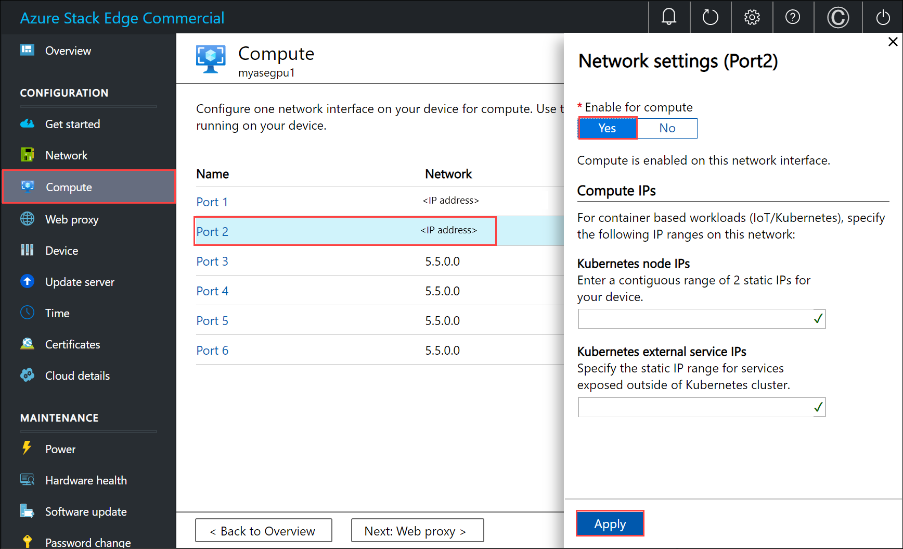

Before you can deploy VMs on your Azure Stack Edge device, you must configure your client to connect to the device via Azure Resource Manager over Azure PowerShell. For detailed instructions, see [Connect to Azure Resource Manager on your Azure Stack Edge device](../articles/databox-online/azure-stack-edge-gpu-connect-resource-manager.md).

Make sure that you can use the following steps to access the device from your client. You've already done this configuration when you connected to Azure Resource Manager, and now you're verifying that the configuration was successful. 


1. Verify that Azure Resource Manager communication is working by running the following command:     

    ### [Az](#tab/Az)

    ```powershell
    Add-AzEnvironment -Name <Environment Name> -ARMEndpoint "https://management.<appliance name>.<DNSDomain>"
    ```
    ### [AzureRM](#tab/AzureRM)

    ```powershell
    Add-AzureRmEnvironment -Name <Environment Name> -ARMEndpoint "https://management.<appliance name>.<DNSDomain>"
    ```

1. To call the local device APIs to authenticate, enter: 

    ### [Az](#tab/Az)

    ```powershell
    login-AzAccount -EnvironmentName <Environment Name> -TenantId c0257de7-538f-415c-993a-1b87a031879d
    ```

    To connect via Azure Resource Manager, provide the username *EdgeArmUser* and your password.

    ### [AzureRM](#tab/AzureRM)

    ```powershell
    login-AzureRMAccount -EnvironmentName <Environment Name> -TenantId c0257de7-538f-415c-993a-1b87a031879d
    ```

    To connect via Azure Resource Manager, provide the username *EdgeArmUser* and your password.

1. If you configured compute for Kubernetes, you can skip this step. Otherwise, ensure that you've enabled a network interface for compute by doing the following: 

   a. On your local user interface, go to **Compute** settings.  
   b. Select the network interface that you want to use to create a virtual switch. The VMs you create will be attached to a virtual switch that's attached to this port and the associated network. Be sure to choose a network that matches the IP address you'll use for the VM.  

    

   c. Under **Enable for compute** on the network interface, select **Yes**. Azure Stack Edge will create and manage a virtual switch that corresponds to that network interface. Don't enter specific IPs for Kubernetes at this time. It can take several minutes to enable compute.

    > [!NOTE]
    > If you're creating GPU VMs, select a network interface that's connected to the internet. Doing so enables you to install a GPU extension on your device.