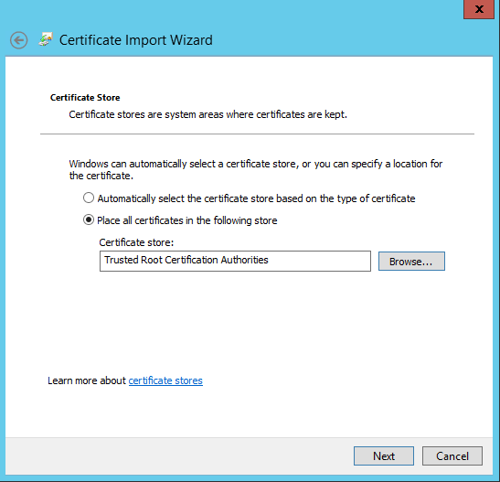

1.	Right-click the `.cer` file and select **Install certificate**. This action starts the Certificate Import Wizard.
2.	For **Store location**, select **Local Machine**, and then click **Next**.

    

3.	Select **Place all certificates in the following store**, and then click **Browse**. Navigate to the root store of your remote host, and then click **Next**.

    

4.	Click **Finish**. A message that tells you that the import was successful appears.

    