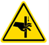
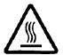
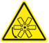

## Safety icon conventions

The signal words for hazard alerting signs are:

| Icon | Description |
|:--- |:--- |
| | **DANGER:** Indicates a hazardous situation that, if not avoided, will result in death or serious injury. |
|  | **WARNING:** Indicates a hazardous situation that, if not avoided, could result in death or serious injury.|
|  | **CAUTION:** Indicates a hazardous situation that, if not avoided, could result in minor or moderate injury.

Hazard symbols identified in the manual are:

| Icon | Description |
|:--- |:--- |
|  | Read all instructions first |
|  **NOTICE:** | Indicates information considered important, but not hazard-related. |
|  | Hazard symbol |
|   | Tip hazard|
|   | Overload tip hazard|
|  | Electric shock hazard |
|  | No user serviceable parts. Do not access unless properly trained. |
|   | Crush or pinching hazard |
|   | Hot surface. Do not touch. Allow to cool before servicing. |
|   | Moving parts hazard |
