If this is the first time you are using Storage Explorer, you need to perform the following steps.

1. From the top command bar, go to **Edit > Target Azure Stack APIs**.

    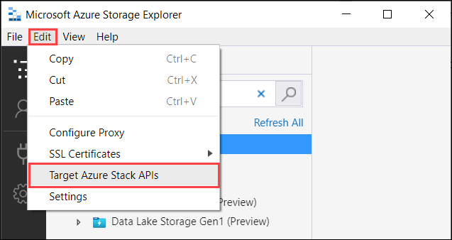

2. Restart the Storage Explorer for the changes to take effect.

Follow these steps to connect to the storage account and verify the connection.

1. In Storage Explorer, select storage accounts. Right-click and select the **Connect to Azure Storage** option. 

    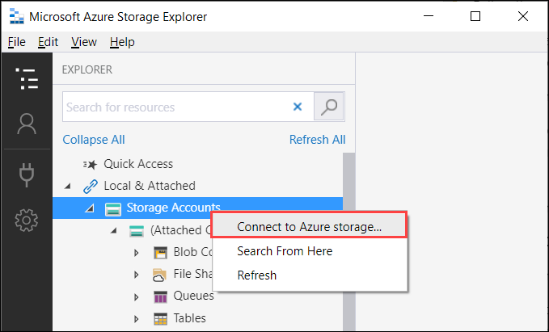

2. In the **Connect to Azure Storage** dialog, select **Use a storage account name and key**.

    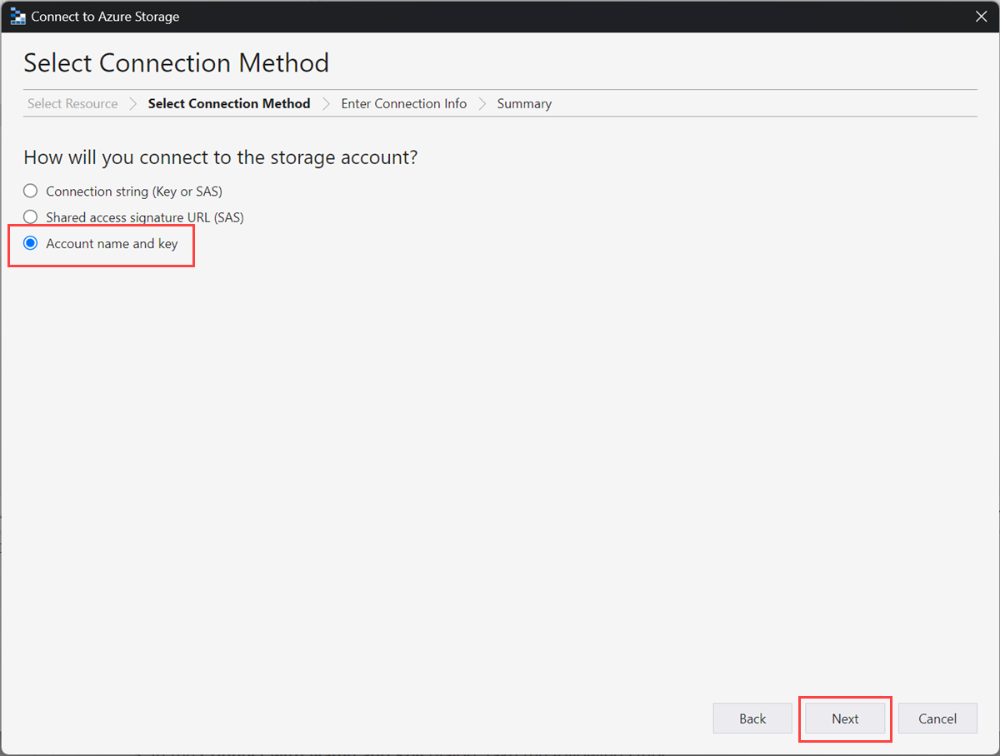

2. In the **Connect with Name and Key** dialog, take the following steps:

    1. Enter a display name for your Edge storage account. 
    2. Provide the Edge storage account name.
    3. Paste the access key that you got from the device local APIs via Azure Resource Manager.
    4. Select Storage domain as **Other (enter below)** and then provide the suffix of blob service endpoint in the format: `<appliance name>.<DNSdomain>`. 
    5. Check **Use HTTP** option as transfer is over *http*. 
    6. Select **Next**.

    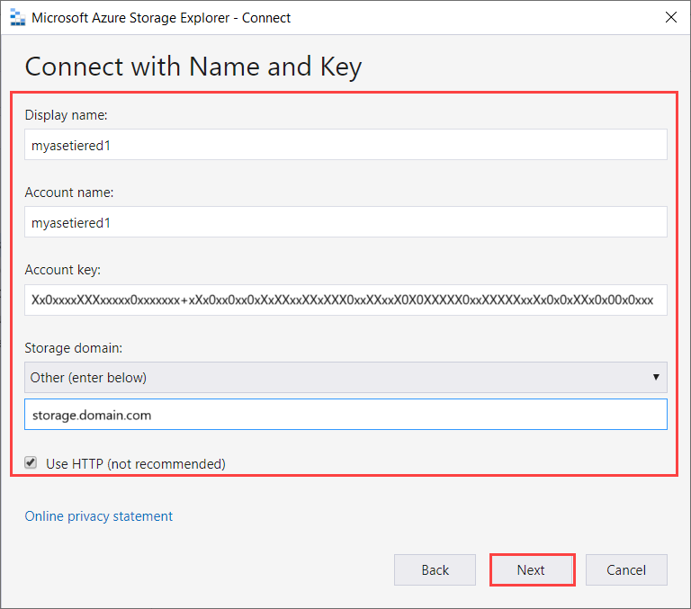    

3. In the **Connection Summary** dialog, review the provided information. Select **Connect**.

    

4. The account that you successfully added is displayed in the left pane of Storage Explorer with (External, Other) appended to its name. Select **Blob Containers** to view the container.

    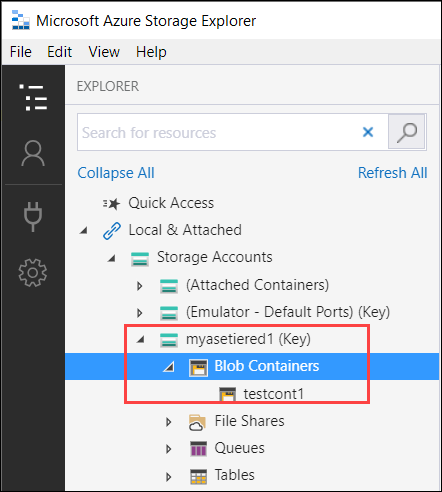

The next step to verify is that the data transfer is actually working correctly over this connection.

Take the following steps to load data into your Edge storage account on the device and it should automatically get tiered to the mapped Azure Storage account.

1. Select the container to which you want to load the data in your Edge storage account. Select **Upload** and then select **Upload files**.

    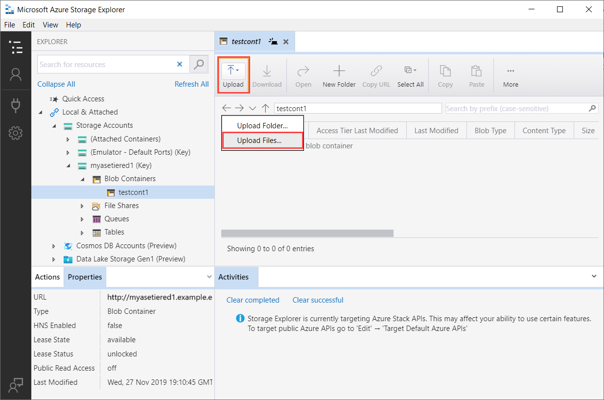

2. In the **Upload files** dialog, navigate to and select the files that you want to upload. Select **Next**.

    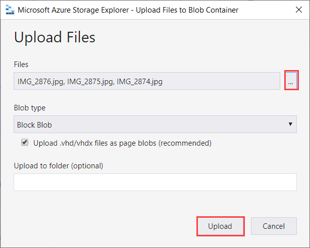

3. Verify that the files have uploaded. The uploaded files show up in the container.

    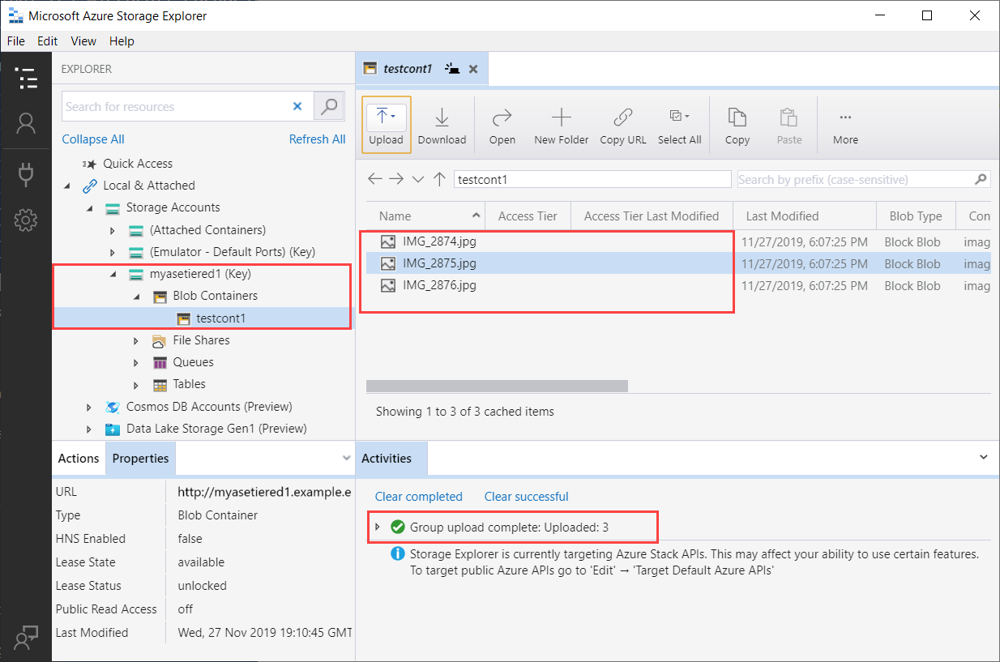

4. Next, you will connect to the Azure Storage account that was mapped to this Edge storage account. Any data that is uploaded to the Edge storage account should automatically tier to the Azure Storage account. 
    
    To get the connection string for the Azure Storage account, go to the **Azure Storage account > Access keys** and copy the connection string.

    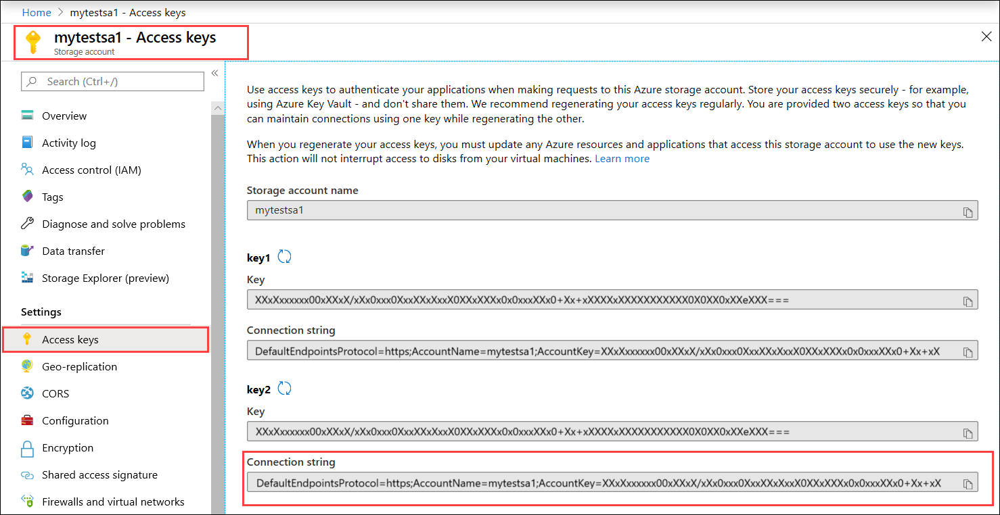

    Use the connection string to attach to the Azure Storage account.  

    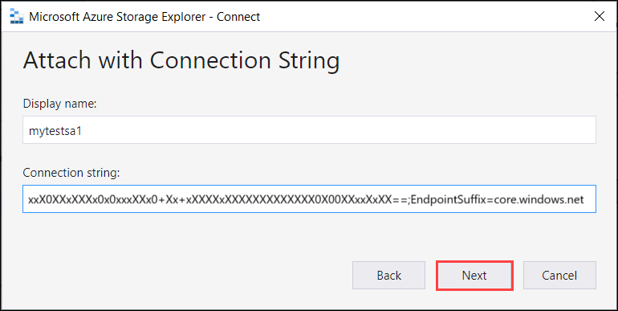

5. In the **Connection Summary** dialog, review the provided information. Select **Connect**.

    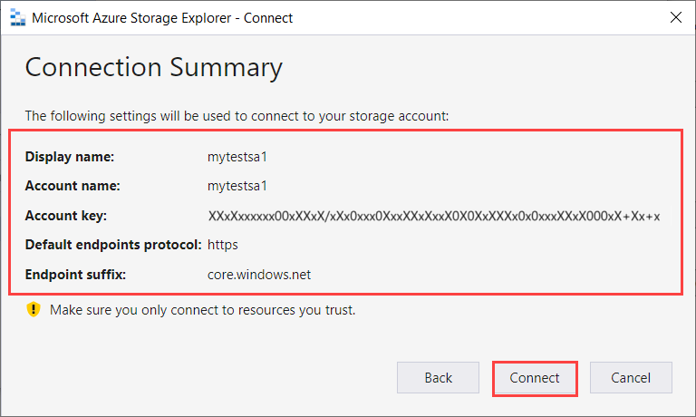

6. You will see that the files you uploaded in the Edge storage account were transferred to the Azure Storage account.

    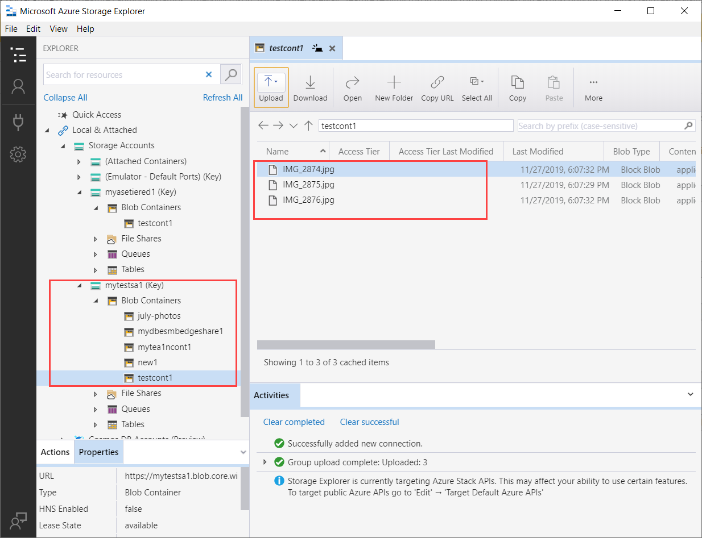
