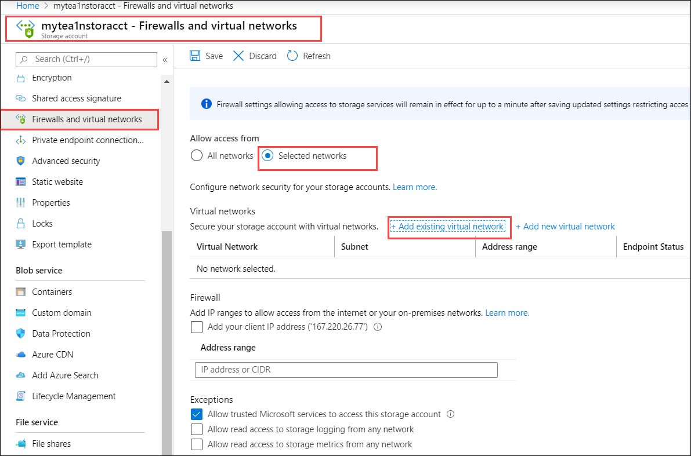
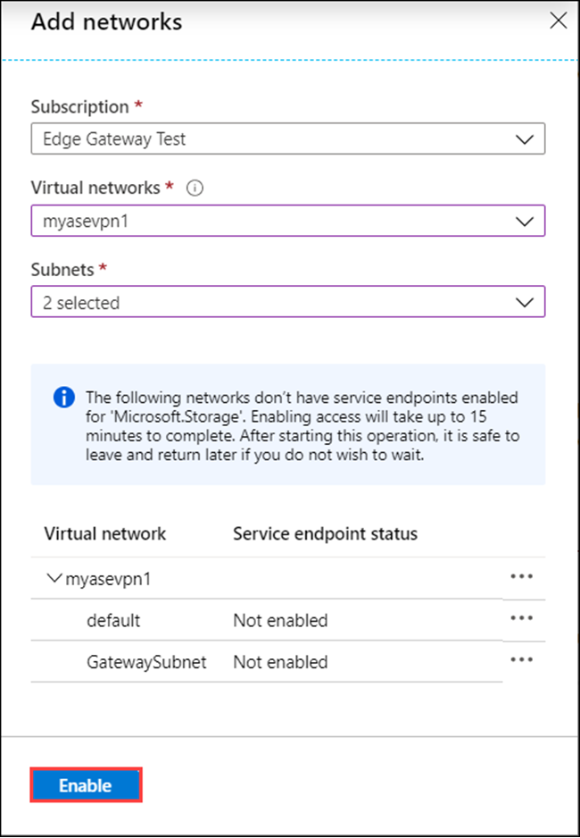
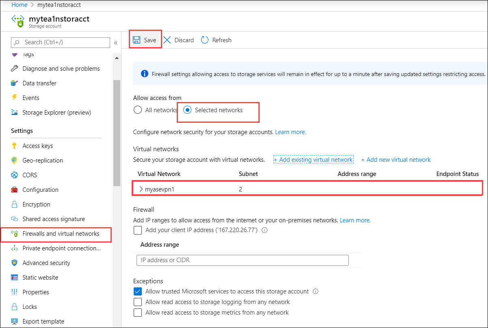
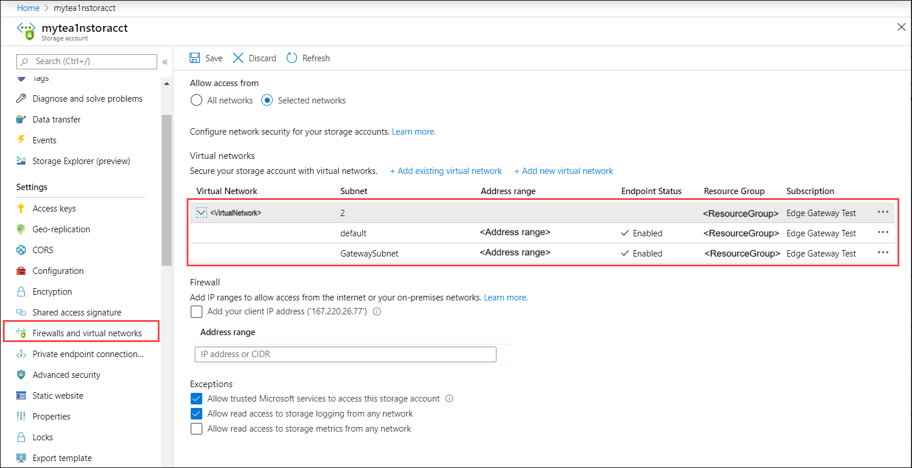

To verify VPN, you can create a storage account that can only be accessed by the virtual network that you created. Follow these steps to create and associate this storage account with the virtual network you created:

1. Create a storage account. You can use the storage account that you plan to use with your Azure Stack Edge device. Try accessing the storage account from an external network (outside of selected network). The storage account should be accessible.
2. In the Azure portal, go to the storage account. 
3. Go to **Firewalls and virtual networks**. In the right pane for **Allow access from**, choose **Selected networks**. In the **Secure our storage account with virtual networks**, choose **+ Add existing virtual network.**

    

4. In the **Add networks** blade:

    - Select the subscription. This is the same subscription that is associated with your Azure Stack Edge/ Data Box Gateway resource. 
    - From the dropdown list, choose the virtual network to associate with this storage account. Select the virtual network that you created in the previous step.
    - In **Subnets**, choose the ***default*** and the *GatewaySubnet*. The service endpoints will be enabled for this virtual network/Subnet combinations. Enabling access takes up to 15 minutes to complete.
    - Select **Enable**.

    
    
4. Save **Settings**.

    

5. After settings are saved, you can see the subnets for which the virtual network is enabled.

    

5. To verify that data will now go only over VPN, follow these steps: 
    - Try accessing the storage account from an external network (outside of selected network). The storage account shouldn't be accessible. 
    - Try accessing the storage account from virtual network/subnets that you enabled in selected networks. The storage account should be accessible. 
 
You can access this storage account only if you have the VPN enabled. If you disable VPN, you'll also need to adjust the network settings of the storage account. 

For more information, go to [Configure Azure Storage firewalls and virtual networks](../articles/storage/common/storage-network-security.md). 

