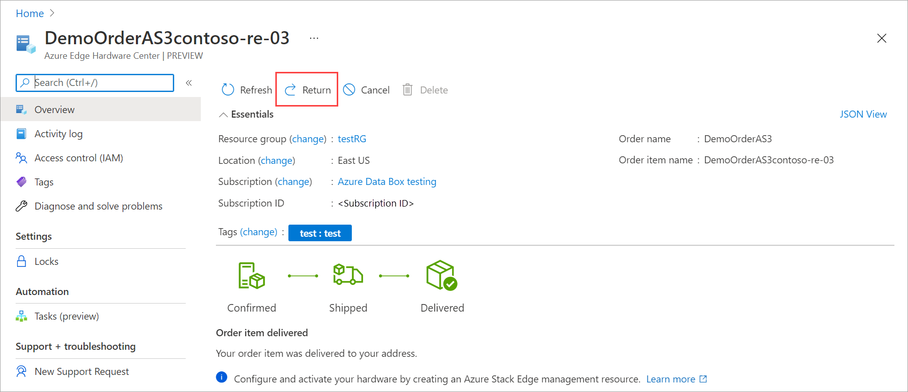
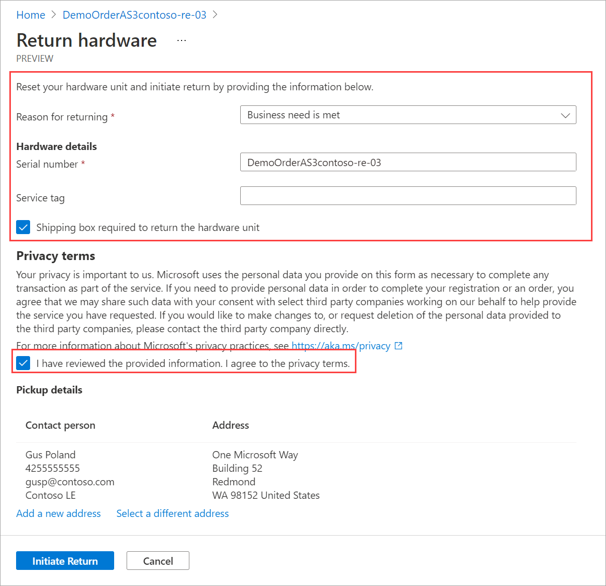
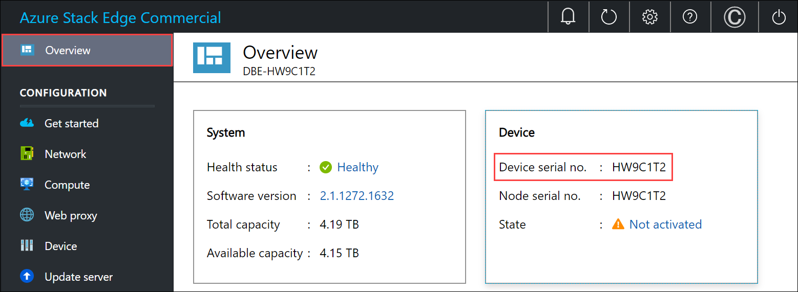
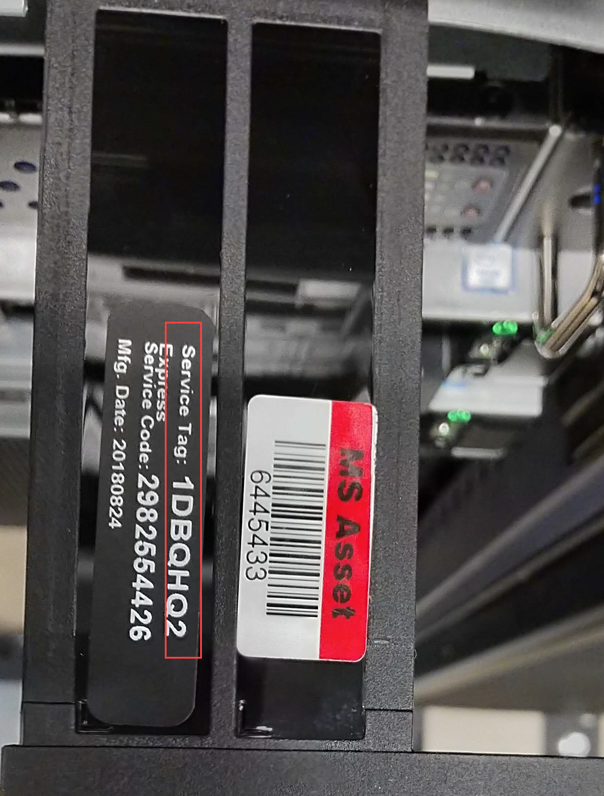
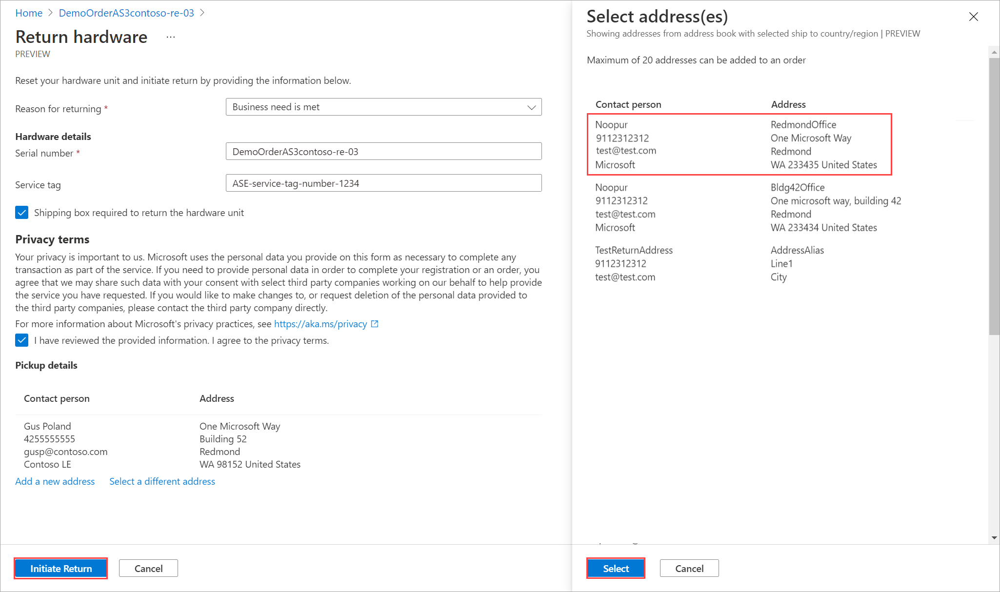
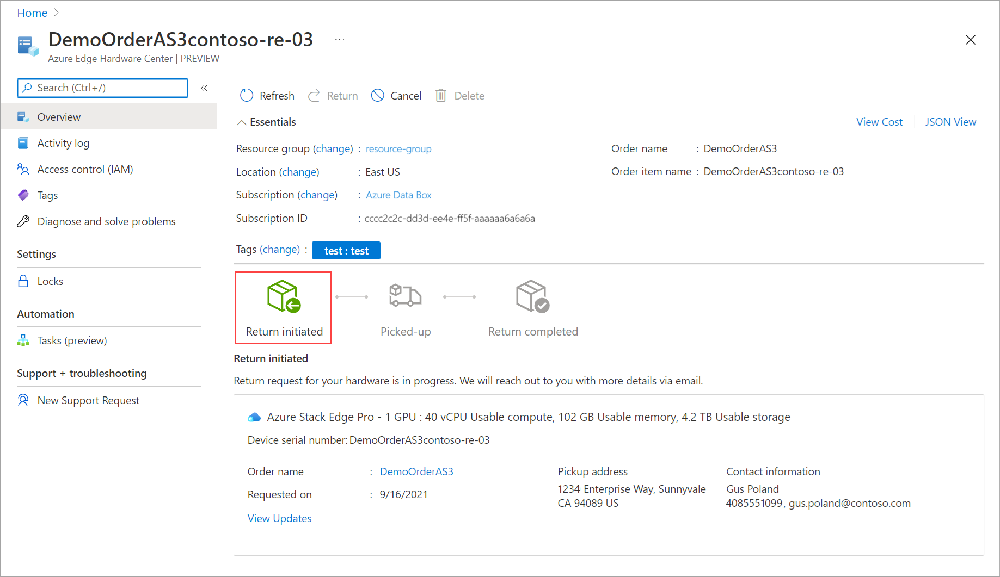

1. In the Azure portal, go to your Azure Edge Hardware Center order item resource. In the **Overview**, go to the top command bar in the right pane and select **Return**. The return option is only enabled after you have received a device.

      

1. In the **Return hardware** blade, provide the following information:

     

    1. From the dropdown list, select a **Reason for returning**.

    1. Provide the serial number of the device. To get the device serial number, go the local web UI of the device and then go to **Overview**.  
    
        

    1. (Optionally) Enter the **Service tag** number. The service tag number is an identifier with five or more characters, which is unique to your device. The service tag is located on the bottom-right corner of the device (as you face the device). Pull out the information tag (it is a slide-out label panel). This panel contains system information such as service tag, NIC, MAC address, and so on. 
    
       

    1. To request a return shipping box, check the **Shipping box required to return the hardware unit**.you can request it. Answer **Yes** to the question **Need an empty box to return**.
    
    1. Review the **Privacy terms**, and select the checkbox by the note that you have reviewed and agree to the privacy terms.

    1. Verify the **Pickup details**. By default, these are set to your shipping address. You can add a new address or select a different one from the saved addresses for the return pickup.

         

    1. Select **Initiate return**.

1. Once the return request is submitted, the order item resource starts reflecting the status of your return shipment. The status progresses from **Return initiated** to **Picked up** to **Return completed**. Use the portal to check the return status of your resource at any time.

     

1. Once the request is initiated, the Azure Stack Edge operations team reaches out to you to help schedule the device pickup.
