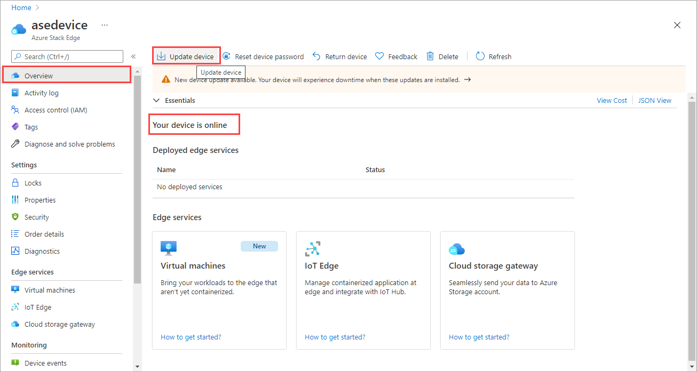
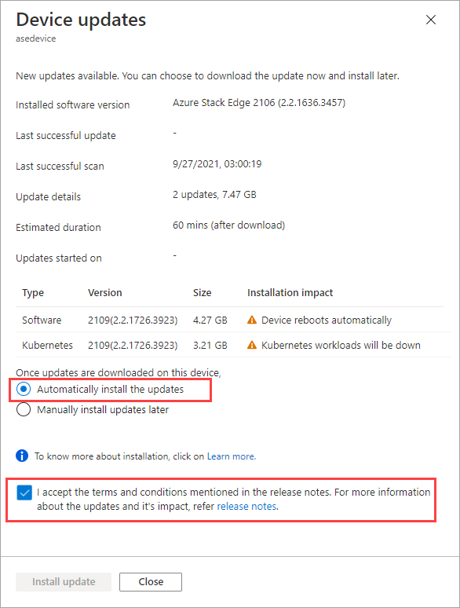
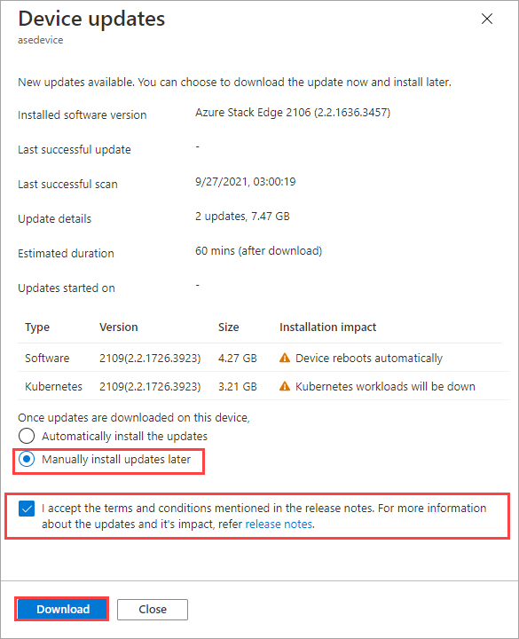
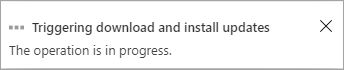
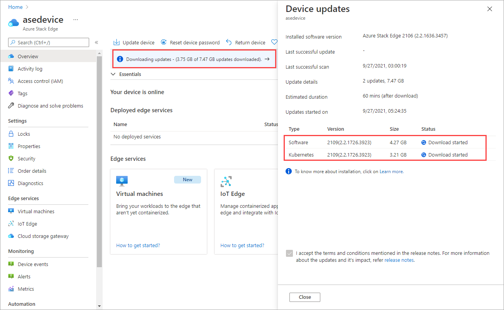
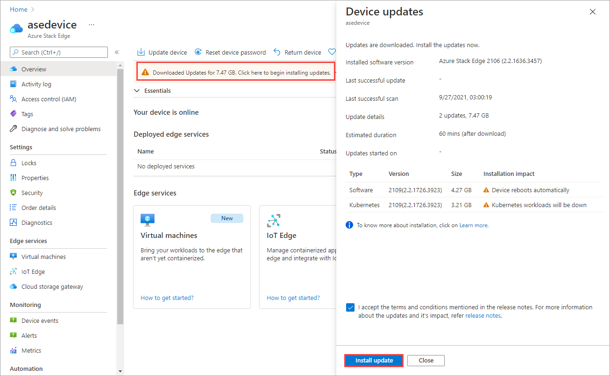
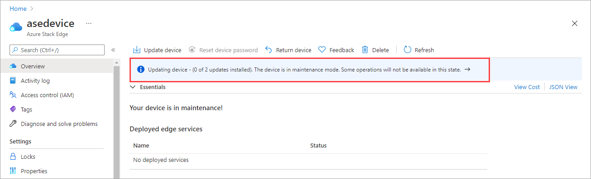
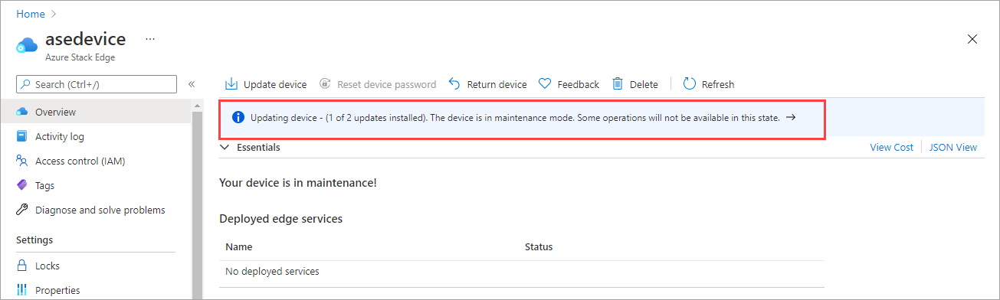
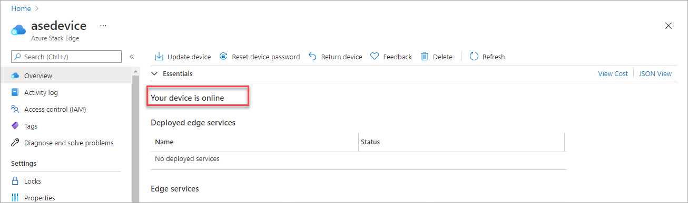

1. When the updates are available for your device, you see a notification in the **Overview** page of your Azure Stack Edge resource. Select the notification or from the top command bar, **Update device**. This will allow you to apply device software updates.

    

2. In the **Device updates** blade, check that you have reviewed the license terms associated with new features in the release notes.

    Once the updates are downloaded on the device, you can choose to **Automatically install** the updates. 

        

    You can also just download the updates and then **Manually install updates later**.

    

3. The download of updates starts. You see a notification that the download is in progress.

    

    A notification banner is also displayed in the Azure portal. This indicates the download progress. You can select this notification or select **Update device** to see the detailed status of the update.

    

4. After the download is complete, the notification banner updates to indicate the completion. If you chose to automatically install the updates, the installation begins automatically.

    If you chose to manually install updates later, then select the notification to open the **Device updates** blade. Select **Install update**.
 
    
 
5. You see a notification that the install is in progress. The portal also displays an informational alert to indicate that the install is in progress. The device goes offline and is in maintenance mode.
   
    

6. As this is a 1-node device, the device restarts after the updates are installed. 

    

7. After the restart, the device software will finish updating. The Kubernetes software update will start automatically. The device goes offline again and is in maintenance mode.

       

8. Once the device software and Kubernetes updates are successfully installed, the banner notification disappears. The device status updates to **Your device is online**. 

    

    Go to the local web UI and then go to **Software update** page. Verify that the device software and Kubernetes are successfully updated and the software version reflects that.

    

