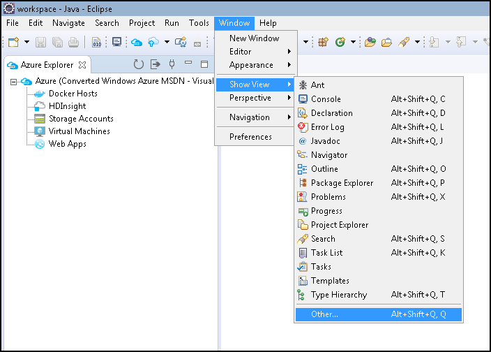
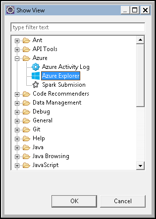

## Display the Azure Explorer view

If the **Azure Explorer** view is not visible in Eclipse, display it by doing the following:

1. Click **Window**, click **Show View**, and then click **Other**.

   

2. In the **Show View** dialog box, select **Azure Explorer**, and then click **OK**.

   

