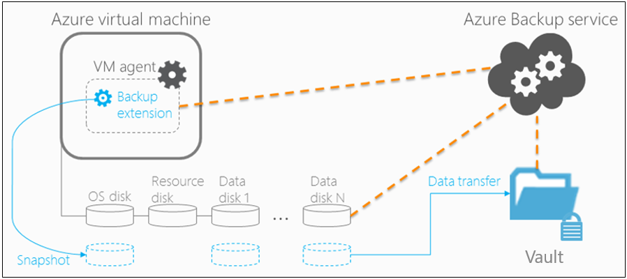

1. For Azure VMs that are selected for backup, Azure Backup starts a backup job according to the backup schedule you specify.
1. During the first backup, a backup extension is installed on the VM if the VM is running.
    - For Windows VMs, the [VMSnapshot extension](../articles/virtual-machines/extensions/vmsnapshot-windows.md) is installed.
    - For Linux VMs, the [VMSnapshotLinux extension](../articles/virtual-machines/extensions/vmsnapshot-linux.md) is installed.
1. For Windows VMs that are running, Backup coordinates with Windows Volume Shadow Copy Service (VSS) to take an app-consistent snapshot of the VM.
    - By default, Backup takes full VSS backups.
    - If Backup can't take an app-consistent snapshot, then it takes a file-consistent snapshot of the underlying storage (because no application writes occur while the VM is stopped).
1. For Linux VMs, Backup takes a file-consistent backup. For app-consistent snapshots, you need to manually customize pre/post scripts.
1. After Backup takes the snapshot, it transfers the data to the vault.
    - The backup is optimized by backing up each VM disk in parallel.
    - For each disk that's being backed up, Azure Backup reads the blocks on the disk and identifies and transfers only the data blocks that changed (the delta) since the previous backup.
    - Snapshot data might not be immediately copied to the vault. It might take some hours at peak times. Total backup time for a VM will be less than 24 hours for daily backup policies.
1. Changes made to a Windows VM after Azure Backup is enabled on it are:
    - Microsoft Visual C++ 2013 Redistributable(x64) - 12.0.40660 is installed in the VM
    - Startup type of Volume Shadow Copy service (VSS) changed to automatic from manual
    - IaaSVmProvider Windows service is added

