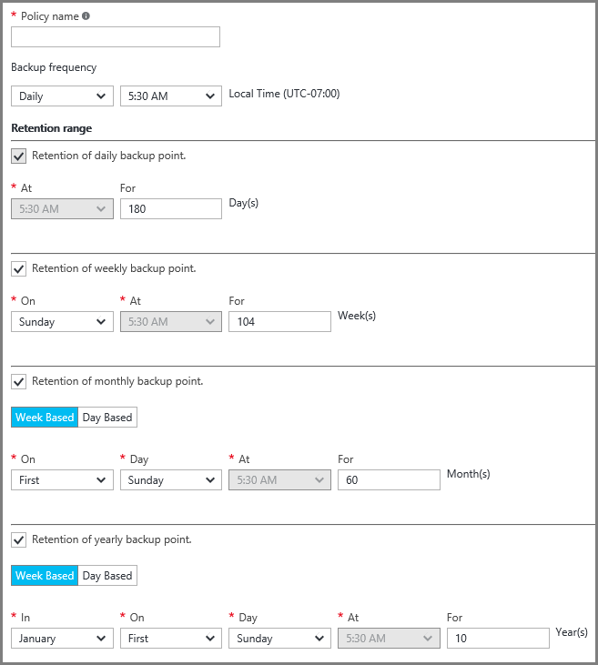
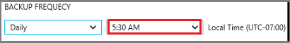

## Defining a backup policy
A backup policy defines a matrix of when the data snapshots are taken, and how long those snapshots are retained. When defining a policy for backing up a VM, you can trigger a backup job *once a day*. When you create a new policy, it is applied to the vault. The backup policy interface looks like this:

To create a policy:

1. Enter a name for the **Policy name**.
2. Snapshots of your data can be taken at Daily or Weekly intervals. Use the **Backup Frequency** drop-down menu to choose whether data snapshots are taken Daily or Weekly.

   * If you choose a Daily interval, use the highlighted control to select the time of the day for the snapshot. To change the hour, de-select the hour, and select the new hour.

       
   * If you choose a Weekly interval, use the highlighted controls to select the day(s) of the week, and the time of day to take the snapshot. In the day menu, select one or multiple days. In the hour menu, select one hour. To change the hour, de-select the selected hour, and select the new hour.

     
3. By default, all **Retention Range** options are selected. Uncheck any retention range limit you do not want to use. Then, specify the interval(s) to use.

    Monthly and Yearly retention ranges allow you to specify the snapshots based on a weekly or daily increment.

   > [!NOTE]
   > 
   > - When protecting a VM, a backup job runs once a day. The time when the backup runs is the same for each retention range.
   > - Recovery point is generated on the date and time when the backup snapshot is completed regardless when the backup job was schedule.
   >   - Ex. If the backup frequency is scheduled at 11:30 PM and due to any issue snapshot is completed at 12:01 AM, then the recovery point will be created with the next date and 12:01 AM.
   > - In case of monthly backup if backup is set to run on first day of every month and if the snapshot is completed on the next day due to some issue then the recovery point created for monthly backup will be tagged with the next day (i.e second of that month).

4. After setting all options for the policy, at the top of the blade click **Save**.

    The new policy is immediately applied to the vault.
