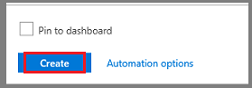

## Create a Recovery Services vault

A Recovery Services vault is an entity that stores the backups and recovery points created over time. The Recovery Services vault also contains the backup policies that are associated with the protected virtual machines.

To create a Recovery Services vault:

1. Sign in to your subscription in the [Azure portal](https://portal.azure.com/).

2. On the left menu, select **All services**.

    

3. In the **All services** dialog box, enter **Recovery Services**. The list of resources filters according to your input. In the list of resources, select **Recovery Services vaults**.

    

    The list of Recovery Services vaults in the subscription appears.

4. On the **Recovery Services vaults** dashboard, select **Add**.

    

    The **Recovery Services vault** dialog box opens. Provide values for the **Name**, **Subscription**, **Resource group**, and **Location**.

    

   - **Name**: Enter a friendly name to identify the vault. The name must be unique to the Azure subscription. Specify a name that has at least two, but not more than 50 characters. The name must start with a letter and consist only of letters, numbers, and hyphens.
   - **Subscription**: Choose the subscription to use. If you're a member of only one subscription, you'll see that name. If you're not sure which subscription to use, use the default (suggested) subscription. There are multiple choices only if your work or school account is associated with more than one Azure subscription.
   - **Resource group**: Use an existing resource group or create a new one. To see the list of available resource groups in your subscription, select **Use existing**, and then select a resource from the drop-down list box. To create a new resource group, select **Create new** and enter the name. For complete information about resource groups, see [Azure Resource Manager overview](../articles/azure-resource-manager/management/overview.md).
   - **Location**: Select the geographic region for the vault. To create a vault to protect virtual machines, the vault **must** be in the same region as the virtual machines.

      > [!IMPORTANT]
      > If you're not sure of the location of your VM, close the dialog box. Go to the list of virtual machines in the portal. If you have virtual machines in several regions, create a Recovery Services vault in each region. Create the vault in the first location, before you create the vault for another location. There's no need to specify storage accounts to store the backup data. The Recovery Services vault and the Azure Backup service handle that automatically.
      >
      >

5. When you're ready to create the Recovery Services vault, select **Create**.

    

    It can take a while to create the Recovery Services vault. Monitor the status notifications in the **Notifications** area at the upper-right corner of the portal. After your vault is created, it's visible in the list of Recovery Services vaults. If you don't see your vault, select **Refresh**.

     
