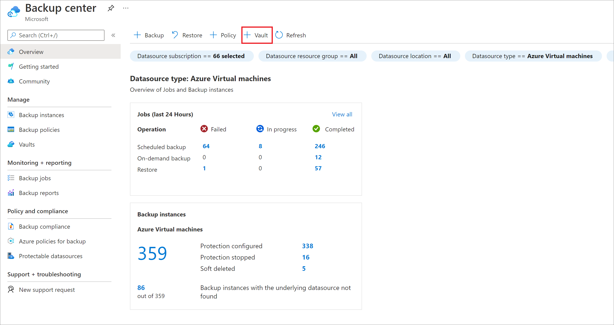
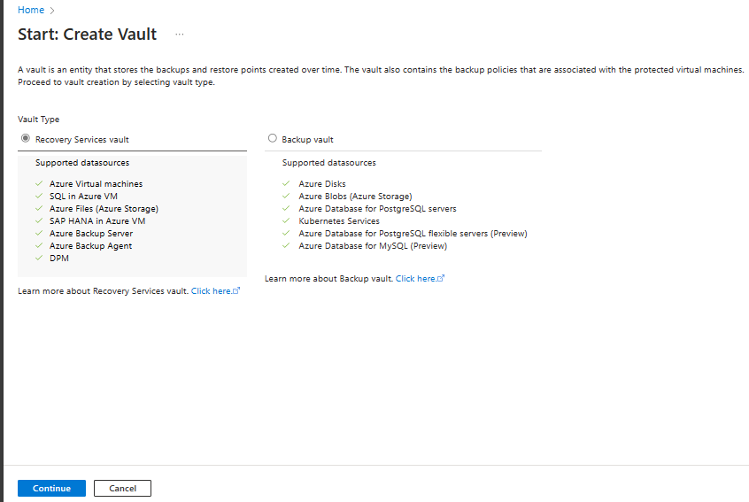
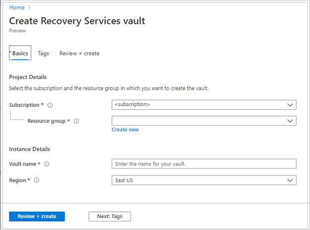

## Create a Recovery Services vault

A Recovery Services vault is a management entity that stores recovery points that are created over time, and it provides an interface to perform backup-related operations. These operations include taking on-demand backups, performing restores, and creating backup policies.

To create a Recovery Services vault:

1. Sign in to the [Azure portal](https://portal.azure.com/).

1. Search for **Backup center**, and then go to the **Backup center** dashboard.

    

1. On the **Overview** pane, select **Vault**.

     

1. Select **Recovery Services vault** > **Continue**.

     

1. On the **Recovery Services vault** pane, enter the following values:

   - **Subscription**: Select the subscription to use. If you're a member of only one subscription, you'll see that name. If you're not sure which subscription to use, use the default subscription. There are multiple choices only if your work or school account is associated with more than one Azure subscription.
   - **Resource group**: Use an existing resource group or create a new one. To view a list of available resource groups in your subscription, select **Use existing**, and then select a resource in the dropdown list. To create a new resource group, select **Create new**, and then enter the name. For more information about resource groups, see [Azure Resource Manager overview](../articles/azure-resource-manager/management/overview.md).
   - **Vault name**: Enter a friendly name to identify the vault. The name must be unique to the Azure subscription. Specify a name that has at least 2 but not more than 50 characters. The name must start with a letter and consist only of letters, numbers, and hyphens.
   - **Region**: Select the geographic region for the vault. For you to create a vault to help protect any data source, the vault *must* be in the same region as the data source.

      > [!IMPORTANT]
      > If you're not sure of the location of your data source, close the window. Go to the list of your resources in the portal. If you have data sources in multiple regions, create a Recovery Services vault for each region. Create the vault in the first location before you create a vault in another location. There's no need to specify storage accounts to store the backup data. The Recovery Services vault and Azure Backup handle that automatically.
      
    

1. After providing the values, select **Review + create**.

1. To finish creating the Recovery Services vault, select **Create**.

   It can take a while to create the Recovery Services vault. Monitor the status notifications in the **Notifications** area at the upper right. After the vault is created, it appears in the list of Recovery Services vaults. If the vault doesn't appear, select **Refresh**.

    

>[!Note]
>Azure Backup now supports immutable vaults that help you ensure that recovery points once created can't be deleted before their expiry as per the backup policy. You can make the immutability irreversible for maximum protection to your backup data from various threats, including ransomware attacks and malicious actors. [Learn more](/azure/backup/backup-azure-immutable-vault-concept).