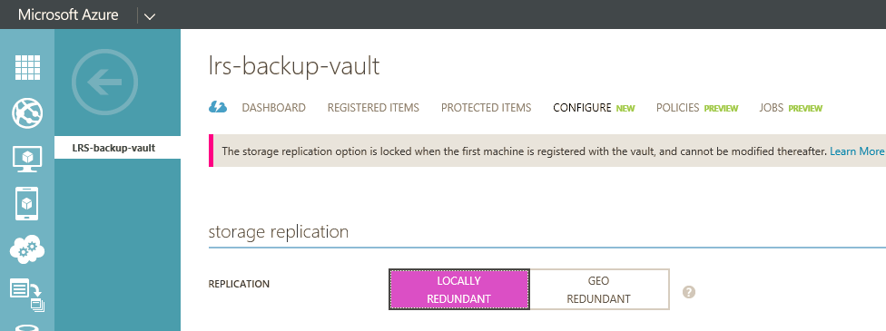

## Create a Backup Vault
To back up files and data from Windows Server or Data Protection Manager (DPM) to Azure or when backing up IaaS VMs to Azure, you must create a backup vault in the geographic region where you want to store the data.

The following steps will walk you through the creation of the vault used to store backups.

1. Sign in to the [Management Portal](https://manage.windowsazure.com/)
2. Click **New** > **Data Services** > **Recovery Services** > **Backup Vault** and choose **Quick Create**.

    

3. For the **Name** parameter, enter a friendly name to identify the backup vault. This needs to be unique for each subscription.

4. For the **Region** parameter, select the geographic region for the backup vault. The choice determines the geographic region to which your backup data is sent. By choosing a geographic region close to your location, you can reduce the network latency when backing up to Azure.

5. Click on **Create Vault** to complete the workflow. It can take a while for the backup vault to be created. To check the status, you can monitor the notifications at the bottom of the portal.

    

6. After the backup vault has been created, a message tells you the vault has been successfully created. The vault is also listed in the resources for Recovery Services as **Active**.

    

### Azure Backup - Storage Redundancy Options

The best time to identify your storage redundancy option is right after vault creation, and before any machines are registered to the vault. Once an item has been registered to the vault, the storage redundancy option is locked and cannot be modified.

Your business needs would determine the storage redundancy of the Azure Backup backend storage. If you are using Azure as a primary backup storage endpoint (e.g. you are backing up to Azure from a Windows Server), you should consider picking (the default) Geo-Redundant storage option. This is seen under the **Configure** option of your Backup vault.

#### Geo-Redundant Storage (GRS)
GRS maintains six copies of your data. With GRS, your data is replicated three times within the primary region, and is also replicated three times in a secondary region hundreds of miles away from the primary region, providing the highest level of durability. In the event of a failure at the primary region, by storing data in GRS, Azure Backup ensures that your data is durable in two separate regions.

#### Locally Redundant Storage (LRS)
Loclly redundant storage (LRS) maintains three copies of your data. LRS is replicated three times within a single facility in a single region. LRS protects your data from normal hardware failures, but not from the failure of an entire Azure facility.

If you are using Azure as a tertiary backup storage endpoint (e.g. you are using SCDPM to have a local backup copy on-premises & using Azure for your long term retention needs), you should consider choosing Locally Redundant Storage from the **Configure** option of your Backup vault. This brings down the cost of storing data in Azure, while providing a lower level of durability for your data that might be acceptable for tertiary copies.

