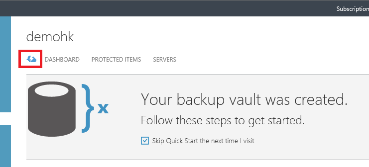
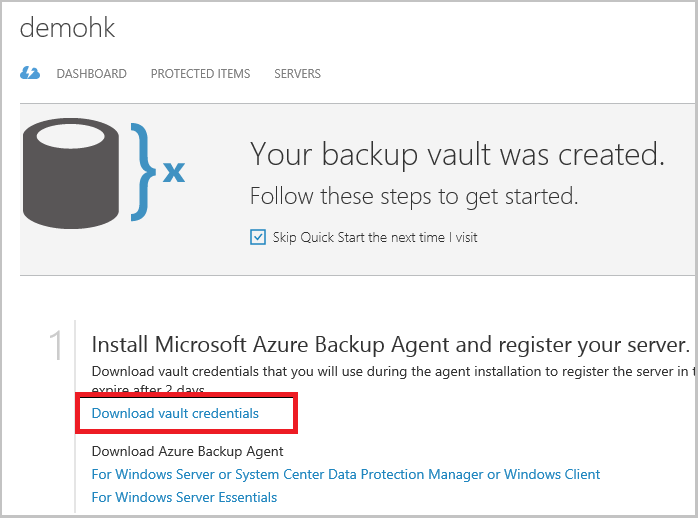

## Using vault credentials to authenticate with the Azure Backup service

The on-premises server (Windows client or Windows Server or Data Protection Manager server) needs to be authenticated with a backup vault before it can back up data to Azure. The authentication is achieved using “vault credentials”. The concept of vault credentials is similar to the concept of a “publish settings” file which is used in Azure PowerShell.

### What is the vault credential file?

The vault credentials file is a certificate generated by the portal for each backup vault. The portal then uploads the public key to the Access Control Service (ACS). The private key of the certificate is made available to the user as part of the workflow which is given as an input in the machine registration workflow. This authenticates the machine to send backup data to an identified vault in the Azure Backup service.

The vault credential is used only during the registration workflow. It is the user’s responsibility to ensure that the vault credentials file is not compromised. If it falls in the hands of any rogue-user, the vault credentials file can be used to register other machines against the same vault. However, as the backup data is encrypted using a passphrase which belongs to the customer, existing backup data cannot be compromised. To mitigate this concern, vault credentials are set to expire in 48hrs. You can download the vault credentials of a backup vault any number of times – but only the latest vault credential file is applicable during the registration workflow.

### Download the vault credential file

The vault credential file is downloaded through a secure channel from the Azure portal. The Azure Backup service is unaware of the private key of the certificate and the private key is not persisted in the portal or the service. Use the following steps to download the vault credential file to a local machine.

1.  Sign in to the [Management Portal](https://manage.windowsazure.com/)
2.  Click on **Recovery Services** in the left navigation pane and select the backup vault which you have created. Click on the cloud icon to get to the Quick Start view of the backup vault.

    

3.  On the Quick Start page, click **Download vault credentials**. The  portal generates the vault credential file, which is made available for download.

    

4.  The portal will generate a vault credential using a combination of the vault name and the current date. Click **Save** to download the vault credentials to the local account's downloads folder, or select Save As from the Save menu to specify a location for the vault credentials.

### Note
- Ensure that the vault credentials is saved in a location which can be accessed from your machine. If it is stored in a file share/SMB, check for the access permissions.
- The vault credentials file is used only during the registration workflow.
- The vault credentials file expires after 48hrs and can be downloaded from the portal.
- Refer to the Azure Backup [FAQ](../articles/backup/backup-azure-backup-faq.md) for any questions on the workflow.
