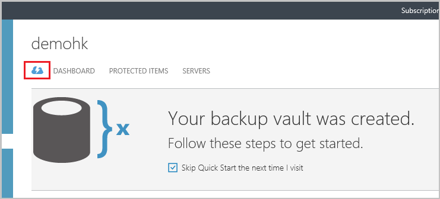
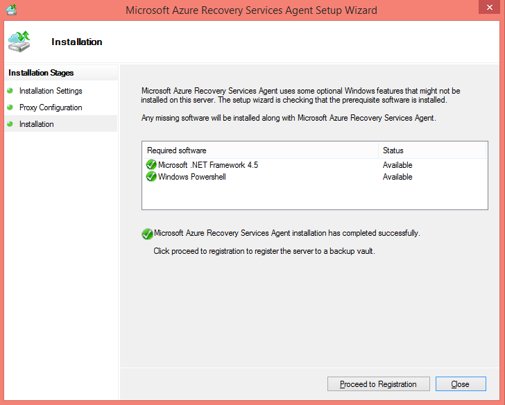
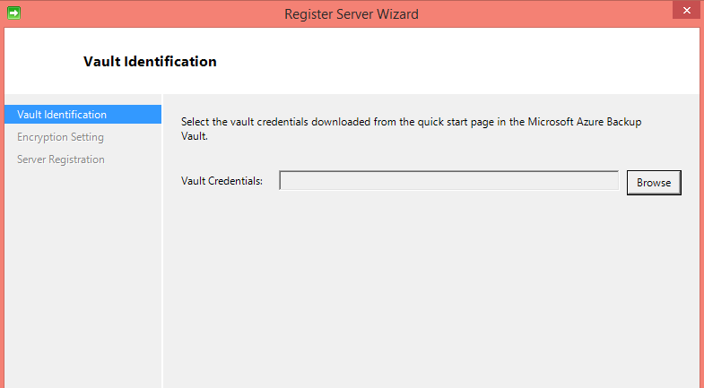
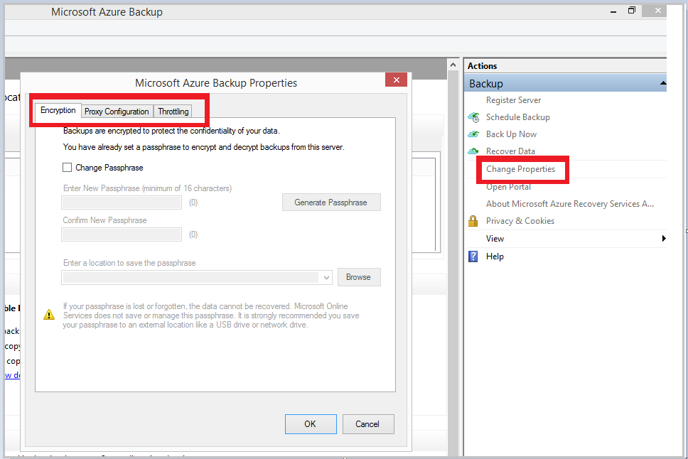
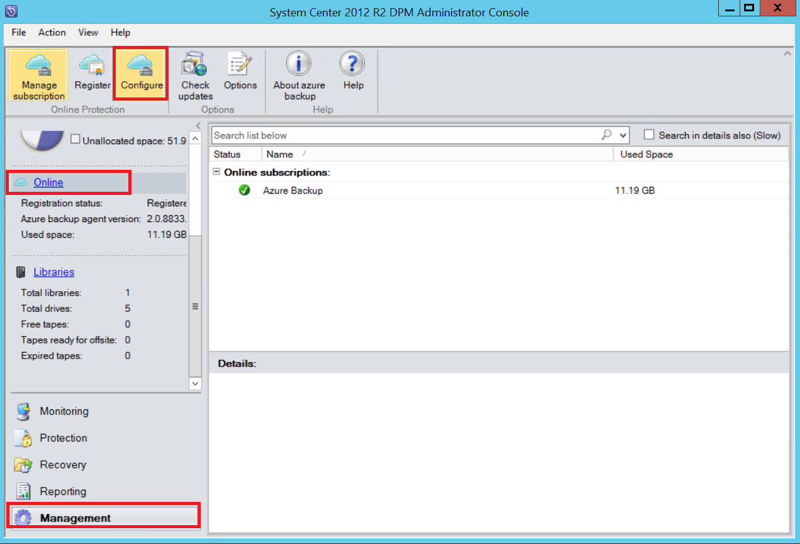

## Download, install, and register the Azure Backup agent

After creating the Azure Backup vault, an agent should be installed on each of your on-premises servers (Windows Server, Windows client or Data Protection Manager server) that enables back up of data and applications to Azure.

1. Sign in to the [Management Portal](https://manage.windowsazure.com/)

2. Click **Recovery Services**, then select the backup vault that you want to register with a server. The Quick Start page for that backup vault appears.

    

3. On the Quick Start page, click the **For Windows Server or System Center Data Protection Manager or Windows client** option under **Download Agent**. Click **Save** to copy it to the local machine.

    

4. Once the agent is installed, double click MARSAgentInstaller.exe to launch the installation of the Azure Backup agent. Choose the installation folder and scratch folder required for the agent. The cache location specified must have free space which is at least 5% of the backup data.

5.	If you use a proxy server to connect to the internet, in the **Proxy configuration** screen, enter the proxy server details. If you use an authenticated proxy, enter the user name and password details in this screen.

6.	The Azure Backup agent installs .NET Framework 4.5 and Windows PowerShell (if it’s not available already) to complete the installation.

7.	Once the agent is installed, click the **Proceed to Registration** button to continue with the workflow.

    

8. In the vault credentials screen, browse to and select the vault credentials file which was previously downloaded.

    

    The vault credentials file is valid only for 48 hrs (after it’s downloaded from the portal). If you encounter any error in this screen (e.g “Vault credentials file provided has expired”), login to the Azure portal and download the vault credentials file again.

    Ensure that the vault credentials file is available in a location which can be accessed by the setup application. If you encounter access related errors, copy the vault credentials file to a temporary location in this machine and retry the operation.

    If you encounter an invalid vault credential error (e.g “Invalid vault credentials provided") the file is either corrupted or does not have the latest credentials associated with the recovery service. Retry the operation after downloading a new vault credential file from the portal. This error is typically seen if the user clicks on the **Download vault credential** option in the Azure portal, in quick succession. In this case, only the second vault credential file is valid.

9. In the **Encryption setting** screen, you can either generate a passphrase or provide a passphrase (minimum of 16 characters). Remember to save the passphrase in a secure location.

    

    > [AZURE.WARNING] If the passphrase is lost or forgotten; Microsoft cannot help in recovering the backup data. The end user owns the encryption passphrase and Microsoft does not have visibility into the passphrase used by the end user. Please save the file in a secure location as it is required during a recovery operation.

10. Once you click the **Finish** button, the machine is registered successfully to the vault and you are now ready to start backing up to Microsoft Azure.

11. When using Microsoft Azure Backup standalone you can modify the settings specified during the registration workflow by clicking on the **Change Properties** option in the Azure Backup mmc snap in.

    

    Alternatively, when using Data Protection Manager, you can modify the settings specified  during the registration workflow by clicking the **Configure** option by selecting **Online** under the **Management** Tab.

    
