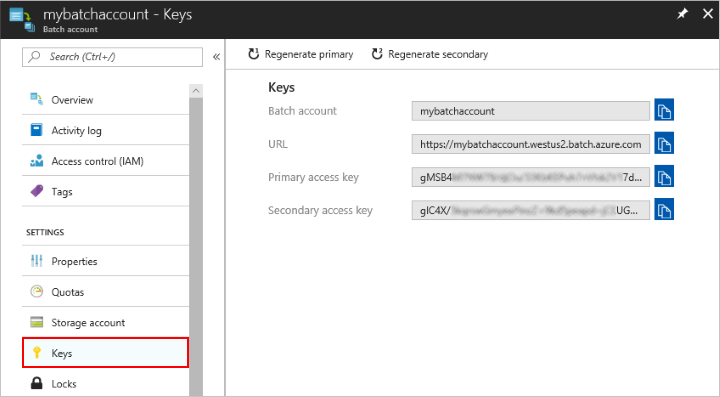
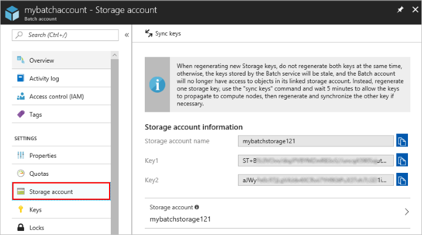

## Get account credentials

To run the sample, you need to provide credentials for your Batch and Storage accounts. A straightforward way to get the necessary credentials is in the [Azure portal](https://portal.azure.com).

1. Log in to the Azure portal at https://portal.azure.com.
2. Click **All services** > **Batch accounts**, and then click the name of your Batch account.
3. To see the Batch credentials, click **Keys**. Copy the values of **Batch account**, **URL**, and **Primary access key**.
    
1. To see the Storage account name and keys, click **Storage account**. Copy the values of **Storage account name** and **Key1**.
  