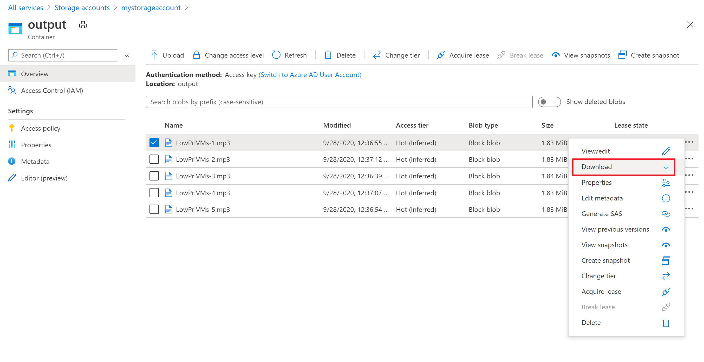

### Retrieve output files

You can use the Azure portal to download the output MP3 files generated by the ffmpeg tasks. 

1. Click **All services** > **Storage accounts**, and then click the name of your storage account.
2. Click **Blobs** > *output*.
3. Right-click one of the output MP3 files and then click **Download**. Follow the prompts in your browser to open or save the file.

Although not shown in this sample, you can also download the files programmatically from the compute nodes or from the storage container.
