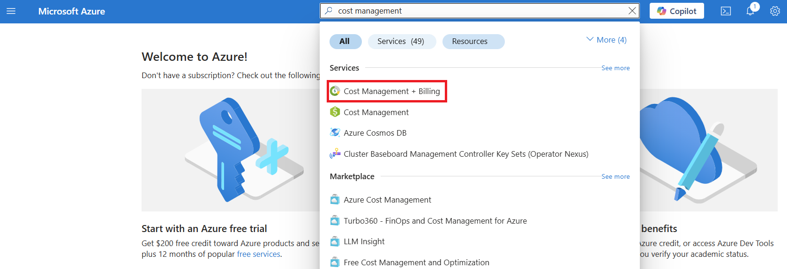
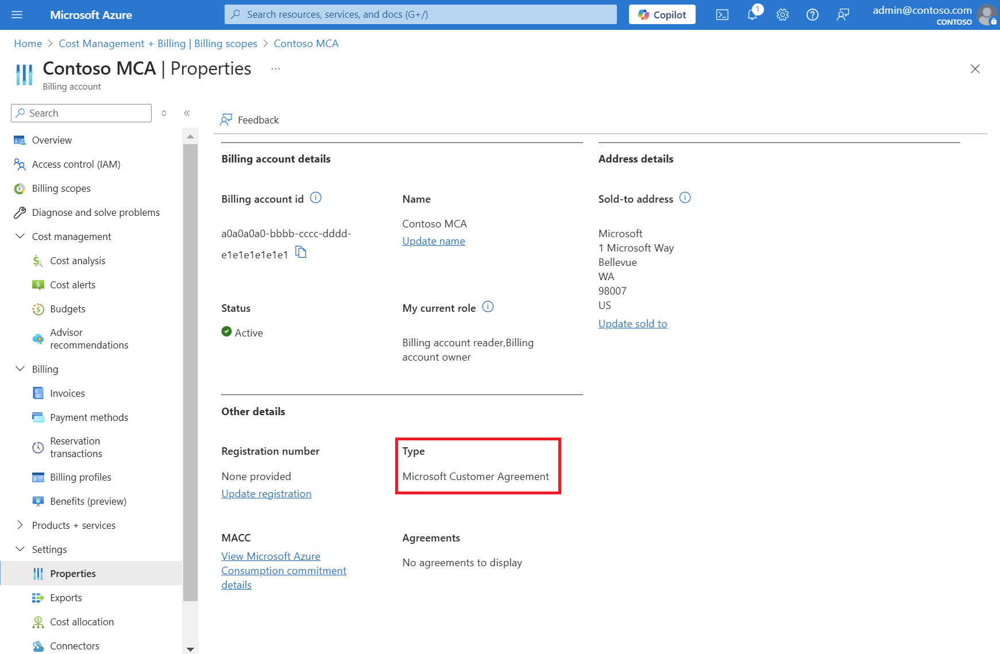
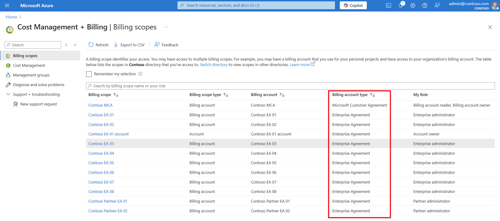

  
1. Sign in to the [Azure portal](https://portal.azure.com).
 
2. Search on **Cost Management + Billing**.
 
       
 
3. If you have access to just one billing scope, select **Properties** from the left-hand side.
 
    
    
    The **Billing account type** on the properties page determines the type of your account. It can be Microsoft Online Service Program, Enterprise Agreement, Microsoft Customer Agreement, or Microsoft Partner Agreement. To learn more about the type of billing accounts, see [View your billing accounts in Azure portal](../articles/cost-management-billing/manage/view-all-accounts.md).  
 
4. If you have access to multiple billing scopes, check the type in the **Billing account type** column.
 
    
 
