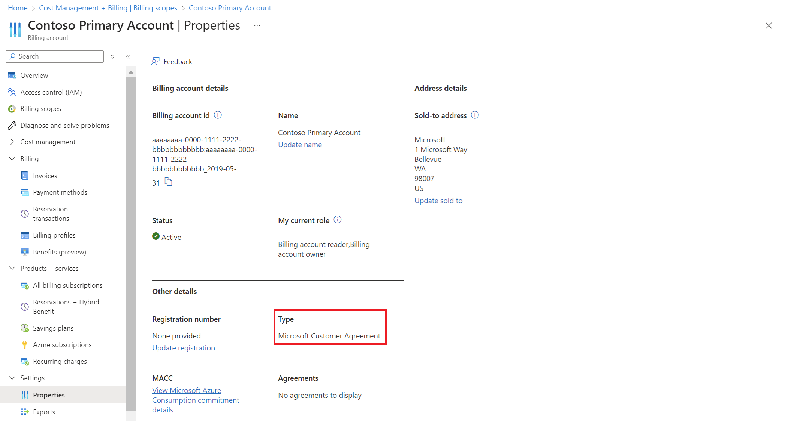
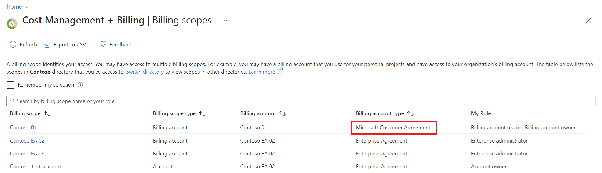

 
Check the agreement type to determine whether you have access to a billing account for a Microsoft Customer Agreement:

1. Go to the Azure portal to check for billing account access. Search for and select **Cost Management + Billing**.

   

2. If you have access to just one billing scope, select **Properties** from the menu. You have access to a billing account for a Microsoft Customer Agreement if the billing account type is **Microsoft Customer Agreement**.

    

   If you have access to multiple billing scopes, check the type in the billing account column. You have access to a billing account for a Microsoft Customer Agreement if the billing account type for any of the scopes is **Microsoft Customer Agreement**.

    
