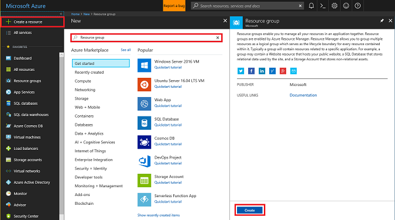
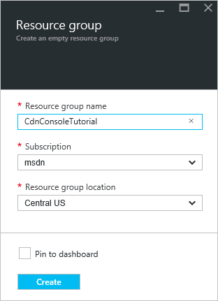
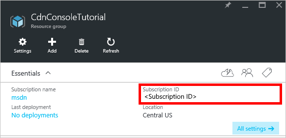
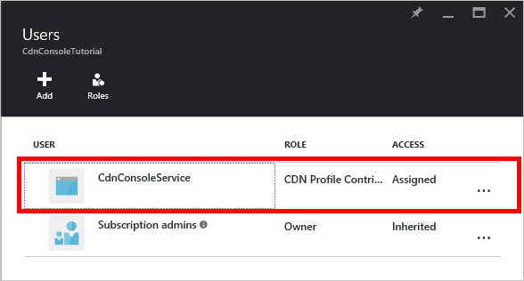
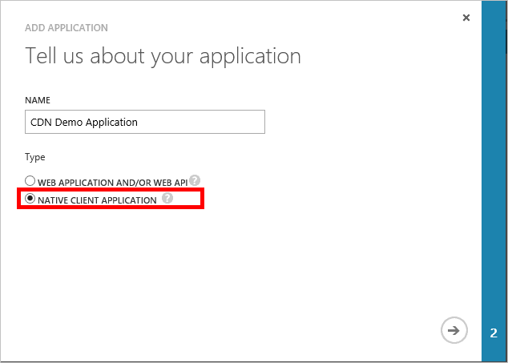

## Prerequisites

Before we can write CDN management code, we need to do some preparation to enable our code to interact with the Azure Resource Manager.  To do this, you'll need to:

* Create a resource group to contain the CDN profile we create in this tutorial
* Configure Azure Active Directory to provide authentication for our application
* Apply permissions to the resource group so that only authorized users from our Azure AD tenant can interact with our CDN profile

### Creating the resource group

1. Log into the [Azure Portal](https://portal.azure.com).

2. Click the **New** button in the upper left, and then **Management**, and **Resource Group**.
	
	

3. Call your resource group *CdnConsoleTutorial*.  Select your subscription and choose a location near you.  If you wish, you may click the **Pin to dashboard** checkbox to pin the resource group to the dashboard in the portal.  This will make it easier to find later.  After you've made your selections, click **Create**.

	

4. After the resource group is created, if you didn't pin it to your dashboard, you can find it by clicking **Browse**, then **Resource Groups**.  Click the resource group to open it.  Make a note of your **Subscription ID**.  We'll need it later.

	

### Creating the Azure AD application and applying permissions

There are two approaches to app authentication with Azure Active Directory: Individual users or a service principal. A service principal is similar to a service account in Windows.  Instead of granting a particular user permissions to interact with the CDN profiles, we instead grant the permissions to the service principal.  Service principals are generally used for automated, non-interactive processes.  Even though this tutorial is writing an interactive console app, we'll focus on the service principal approach.

Creating a service principal consists of several steps, including creating an Azure Active Directory application.  To do this, we're going to [follow this tutorial](../articles/resource-group-create-service-principal-portal.md).

> [AZURE.IMPORTANT] Be sure to follow all the steps in the [linked tutorial](../articles/resource-group-create-service-principal-portal.md).  It is *extremely important* that you complete it exactly as described.  Make sure to note your **tenant ID**, **tenant domain name** (commonly a *.onmicrosoft.com* domain unless you've specified a custom domain), **client ID**, and **client authentication key**, as we will need these later.  Be very careful to guard your **client ID** and **client authentication key**, as these credentials can be used by anyone to execute operations as the service principal. 
> 	
> When you get to the step named [Configure multi-tenant application](../articles/resource-group-create-service-principal-portal.md#configure-multi-tenant-application), select **No**.
> 
> When you get to the step [Assign application to role](../articles/resource-group-create-service-principal-portal.md#assign-application-to-role), use the resource group we created earlier,  *CdnConsoleTutorial*, but instead of the **Reader** role, assign the **CDN Profile Contributor** role.  After you assign the application the **CDN Profile Contributor** role on your resource group, return to this tutorial. 

Once you've created your service principal and assigned the **CDN Profile Contributor** role, the **Users** blade for your resource group should look similar to this.

### Interactive user authentication

If, instead of a service principal, you'd rather have interactive individual user authentication, the process is very similar to that for a service principal.  In fact, you will need to follow the same procedure, but make a few minor changes.

> [AZURE.IMPORTANT] Only follow these next steps if you are choosing to use individual user authentication instead of a service principal.

1. When creating your application, instead of **Web Application**, choose **Native application**. 
	
	
	
2. On the next page, you will be prompted for a **redirect URI**.  The URI won't be validated, but remember what you entered.  You'll need it later. 

3. There is no need to create a **client authentication key**.

4. Instead of assigning a service principal to the **CDN Profile Contributor** role, we're going to assign individual users or groups.  In this example, you can see that I've assigned  *CDN Demo User* to the **CDN Profile Contributor** role.  
	
	

