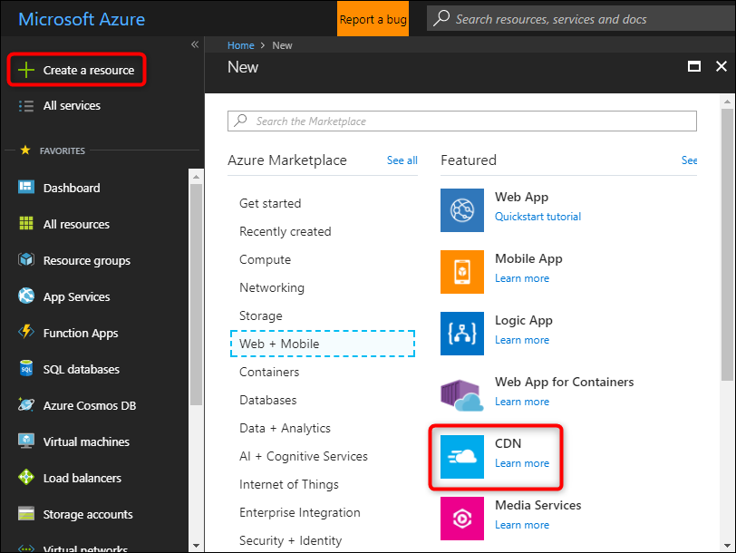
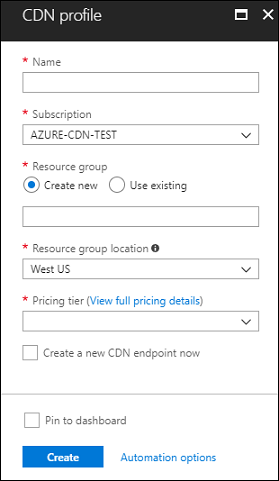

## Create a new CDN profile

A CDN profile is a container for CDN endpoints and specifies a pricing tier.

1. In the Azure portal, select **Create a resource** (on the upper left). The **New** pane appears.
   
1. Search for and select **CDN**, then select **Create**:
   
    

    The **CDN profile** pane appears.

1. Enter the following values:
   
    | Setting  | Value |
    | -------- | ----- |
    | **Name** | Enter *cdn-profile-123* for your profile name. This name must be globally unique; if it's already in use, enter a different name. |
    | **Subscription** | Select an Azure subscription from the drop-down list. |
    | **Resource group** | Select **Create new** and enter *CDNQuickstart-rg* for your resource group name, or select **Use existing** and choose *CDNQuickstart-rg* if you have the group already. | 
    | **Resource group location** | Select a location near you from the drop-down list. |
    | **Pricing tier** | Select a **Standard Akamai** option from the drop-down list. (Deployment time for the Akamai tier is about one minute. The Microsoft tier takes about 10 minutes and the Verizon tiers take about 90 minutes.) |
    | **Create a new CDN endpoint now** | Leave unselected. |  
   
    

1. Select **Create** to create the profile.

