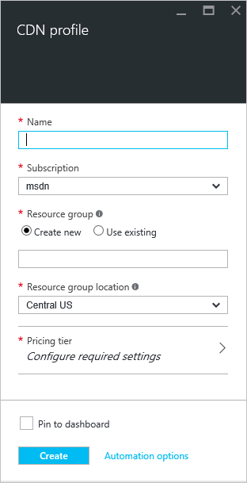
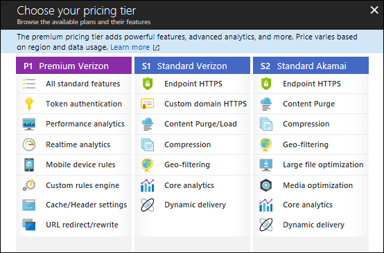

**To create a new CDN profile**

1. In the [Azure Portal](https://portal.azure.com), in the upper left, click **New**.  In the **New** blade, select **Media + CDN**, then **CDN**.

    The new CDN profile blade appears.

    

2. Enter a name for your CDN profile.

3. Select a **Location**.  This is the Azure location where your CDN profile information will be stored.  It has no impact on CDN endpoint locations.

4. Select or create a **Resource Group**.  For more information on Resource Groups, see [Azure Resource Manager overview](resource-group-overview.md#resource-groups).

5. Select a **Pricing tier**.  See the [CDN Overview](cdn-overview.md#azure-cdn-features) for a comparison of pricing tiers.
    
    

6. Select the **Subscription** for this CDN profile.

7. Click the **Create** button to create the new profile. 