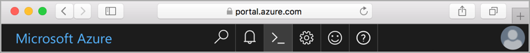

The [Azure Cloud Shell](../articles/cloud-shell/quickstart.md) (in public preview) is a web based shell that is preconfigured to simplify using Azure tools. With Cloud Shell, you always have the most up-to-date version of the tools available and you don’t have to install, update or separately log-in. Just click the  Cloud Shell button on the top navigation in the Azure portal. 

 
If you prefer not to use the Cloud Shell please make sure you have installed the latest version of the [Azure CLI](/cli/azure/install-azure-cli) and log in using the **az login** command.

