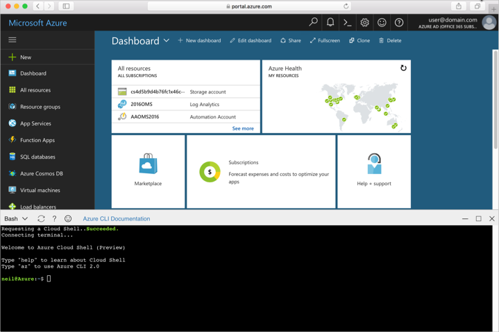

## Launch Azure Cloud Shell

The Azure Cloud Shell is a free bash shell that you can run directly within the Azure Portal. It has the Azure CLI preinstalled and configured to use with your account. Click the **Cloud Shell** button on the menu in the upper-right of the [Azure portal](https://portal.azure.com).

The button launches an interactive shell that you can use to run all of the steps in this topic:

