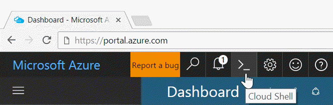

The [Azure Cloud Shell](../articles/cloud-shell/quickstart.md) (in public preview) is a web-based shell that is preconfigured to simplify using Azure tools. With Cloud Shell, you always have the most up-to-date version of the tools available and you don’t have to install, update or separately log in. You can open the Cloud Shell from the Azure portal by clicking the **Cloud Shell** button on the menu in the upper-right of the [Azure portal](https://portal.azure.com).

