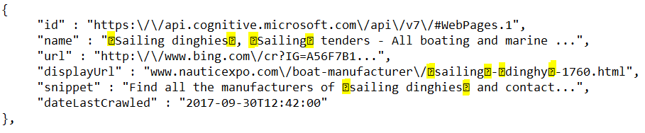
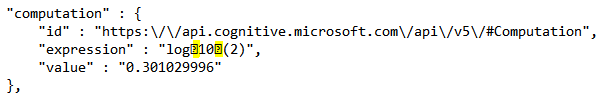

Bing supports hit highlighting which marks query terms (or other terms that Bing finds relevant) in the display strings of some of the answers. For example, a webpage's `name`, `displayUrl`, and `snippet` fields may mark the query terms.

By default, Bing doesn't include highlighting markers in display strings. To include the markers, include the `textDecorations` query parameter in your request and set it to **true**. Bing marks the query terms using the E000 and E001 Unicode characters to mark the beginning and end of the term. For example, if the query term is Sailing Dinghy and either term exists in the field, the term is enclosed in hit highlighting characters as shown in the following example:  
  
 

Before displaying the string in your user interface, you would replace the Unicode characters with characters that are appropriate for your display format. For example, if you're displaying the text as HTML, you might highlight the query term by replacing E000 with <b\> and E001 with </b\>. If you don't want to apply formatting, remove the markers from the string. 

Bing provides the option of using Unicode characters or HTML tags as markers. To specify which markers to use, include the `textFormat` query parameter. To mark the content with Unicode characters, set `textFormat` to Raw (the default), and to mark the content with HTML tags, set `textFormat` to HTML. 
  
If `textDecorations` is **true**, Bing may include the following markers in display strings of answers. If there is no HTML equivalent, the HTML table cell is empty.

|Unicode|HTML|Description
|-|-|-
|U+E000|\<b>|Marks the beginning of the query term (hit highlighting)
|U+E001|\</b>|Marks the end of the query term
|U+E002|\<i>|Marks the beginning of italicized content 
|U+E003|\</i>|Marks the end of italicized content
|U+E004|\ |Marks a line break
|U+E005||Marks the beginning of a phone number
|U+E006||Marks the end of a phone number
|U+E007||Marks the beginning of an address
|U+E008||Marks the end of an address
|U+E009|\&nbsp;|Marks a non-breaking space
|U+E00C|\<strong>|Marks the beginning of bold content
|U+E00D|\</strong>|Marks the end of bold content
|U+E00E||Marks the beginning of content whose background should be lighter than its surrounding background
|U+E00F||Marks the end of content whose background should be lighter than its surrounding background
|U+E010||Marks the beginning of content whose background should be darker than its surrounding background
|U+E011||Marks the end of content whose background should be darker than its surrounding background
|U+E012|\<del>|Marks the beginning of content that should be struck through
|U+E013|\</del>|Marks the end of content that should be struck through
|U+E016|\|Marks the beginning of subscript content
|U+E017|\|Marks the end of subscript content
|U+E018|\|Marks the beginning of superscript content
|U+E019|\|Marks the end of superscript content

The following example shows a `Computation` answer that contains subscript markers for a log(2) query term. The `expression` field contains the markers only if `textDecoration` is **true**.

 

If the request did not request decorations, the expression would be log10(2). 
  
