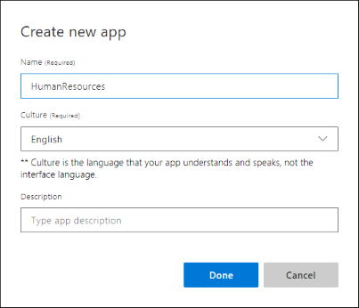

1. Sign in to the LUIS portal with the URL of [https://www.luis.ai](https://www.luis.ai). 

1. Select **Create new app**.  

    [ My Apps page")](./media/cognitive-services-luis/tutorials-create-new-app/app-list.png#lightbox)

1. In the pop-up dialog, enter the name `HumanResources` and keep the default culture, **English**. Leave the description empty.

    

1. Select **Done**. 

