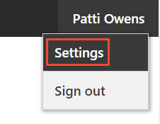

---
title: include file
description: include file 
services: cognitive-services
author: diberry
manager: cgronlun
ms.service: cognitive-services
ms.component: luis
ms.topic: include
ms.custom: include file
ms.date: 08/16/2018
ms.author: diberry
--- 

Access to the prediction endpoint is provided with an endpoint key. For the purposes of this quickstart, use the free starter key associated with your LUIS account. 
 
1. Sign in using your LUIS account. 

    [ app list")](media/cognitive-services-luis/app-list.png)

2. Select your name in the top right menu, then select **Settings**.

    

3. Copy the value of the **Authoring key**. You will use it later in the quickstart. 

    [ user settings")](media/cognitive-services-luis/get-user-authoring-key.png)

    The authoring key allows free unlimited requests to the authoring API and up to 1000 queries to the prediction endpoint API per month  for all your LUIS apps. <!--Once the prediction endpoint quota from the authoring key is used for the month, you need to create a **Language Understanding** key from the Azure portal. The key created in the portal is known as the endpoint key. The endpoint key is used _only_ for prediction endpoint queries.-->