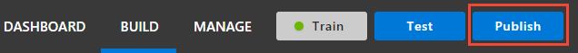
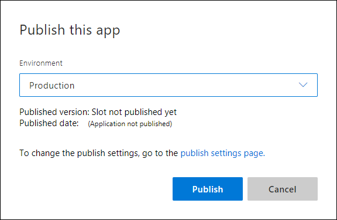

---
title: include file
description: include file 
services: cognitive-services
author: diberry
manager: cgronlun
ms.service: cognitive-services
ms.component: luis
ms.topic: include
ms.custom: include file
ms.date: 08/17/2018
ms.author: diberry
--- 

In order to receive a LUIS prediction in a chat bot or other client application, you need to publish the app to the endpoint. 

1. Select **Publish** in the top right navigation.

    

2. Select the **Production** slot and the **Publish** button.

    

3. Publishing is complete when you see the green status bar at the top of the website confirming success.

    

4. Select the **endpoints** link in the green status bar to go to the **Keys and endpoints** page. The endpoint URLs are listed at the bottom.

    <!-- TBD: add image -->